# Creating a System with SDx

## Objectives

After completing this lab, you will be able to:

* Create a new SDx project for your application from several available platforms and project templates
* Mark functions for hardware implementation
* Build your project to generate a bitstream containing the hardware implemented function and a software executable file that invokes this hardware implemented function
* Test the design in hardware

## Steps

## Create an SDx Project 
### Launch SDx and create a project, called lab1, using one of the available templates, targeting the PYNQ-Z1 or PYNQ-Z2 board.
1. Open SDx by selecting **Start \&gt;**  **Xilinx Design Tools**  **\&gt; SDx IDE 2018.2**

	The Workspace Launcher window will appear.

1. Click on the _Browse_ button and browse to **{labs}** and click **OK**.
    

    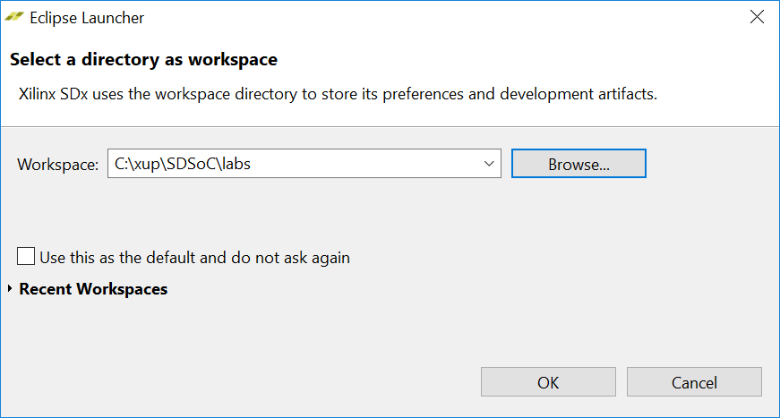
    

    

    <i>Selecting a workspace</i>
    

1. Click **OK**.

	The SDx development environment window will appear showing the Welcome tab.

    

    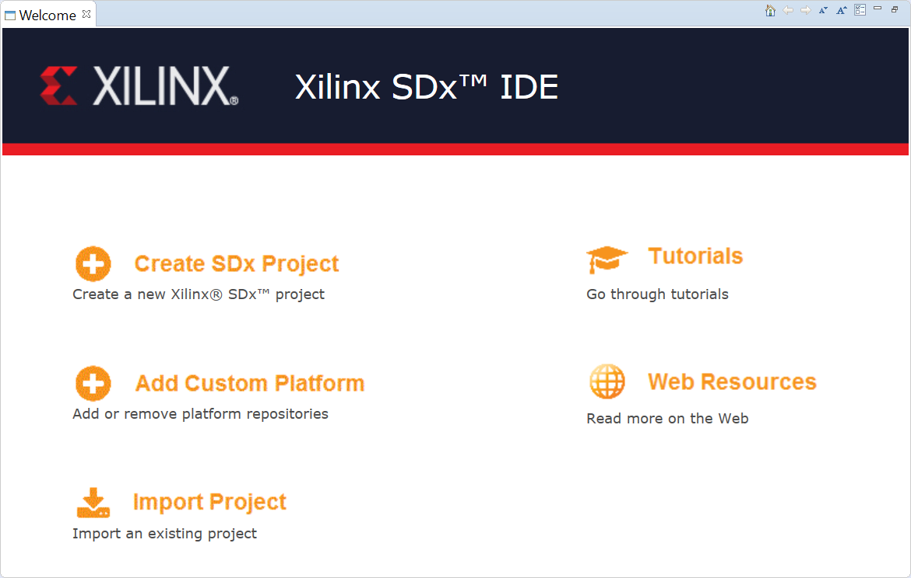
    

    

    <i>The SDx development environment with Welcome tab
</i>
    

	From here you can create a new project, create an application project, import an existing project, and access the tutorials and web resources by clicking on the desired link.

1. Click on the **Create SDx Project** link to see _Project_ Type form with **Application** type selected.
1. Click **Next** and _Create a New SDx Project_ form will appear. Enter **lab1** in the _Project name_ field **.**

    

    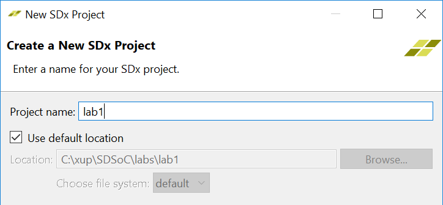
    

    

    <i>Entering project name</i>
    

	You could have clicked Click X on the Welcome tab to close it, and you would have seen the empty workspace in the background. From there, you would have selected File &gt; New &gt; Xilinx SDx Project to open the New Project GUI. You then would have entered lab1 as the project name.

1. Click **Next** to see _Platform_ window showing various available platforms.
	
	Notice that neither of PYNQ-Z1 or PYNQ-Z2 are listed. We will have to add the board platform as a custom

    

    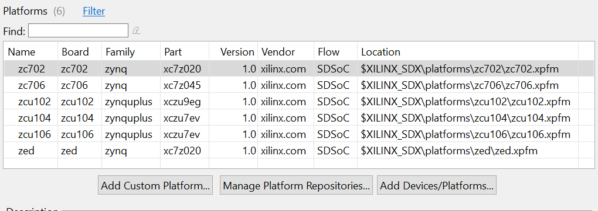
    

    

    <i>Available hardware platforms</i>
    

1. Click the **Add Custom Platform…** button

1. Browse to {labs}\..\2018\_2\_sources, select {board}, and click **OK**

	Notice the board related platform is displayed in the available platforms table

1. Select the {board} and click **Next**.

    

    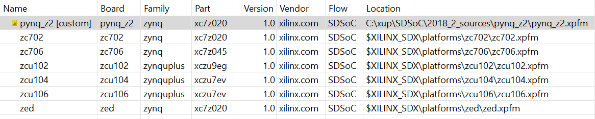
    

    

    <i>Selecting custom platform</i>
    

1. In the _System Configuration_ window select _Linux_ as the target OS and click **Next**.

    

    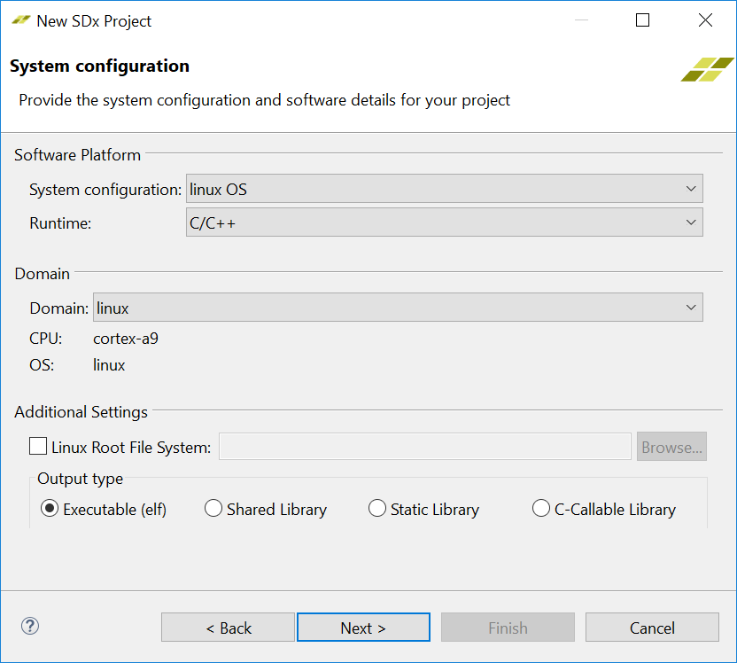
    

    

    <i>Selecting target OS</i>
    

	The Templates page appears, containing source code examples for the selected platform.

1. Select **dataflow** as the source.

    

    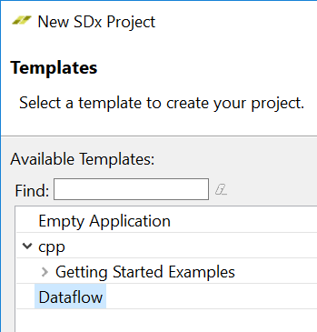
    

    

    <i>Available templates</i>
    

1. Click **Finish**.

	The created project will be displayed. In the left, you will see Project Explorer under which the lab1 project directory will be displayed (you may have to expand the folder). It shows the Includes and src folders. The src folder contains the source files which were copied from the template source directory located at &lt;SDx_install_directory&gt;\samples\<template_name&gt;. The lab1 folder also shows the project.sdx project file. Double-clicking on it will display what you see in the right-side pane.

	In the SDx Project Settings pane, you see General, Hardware Functions, and Options areas. From here you will be able to change options, identify/modify the function(s) that will be implemented in hardware, setup for debugging and estimation, and access various reports.

    

    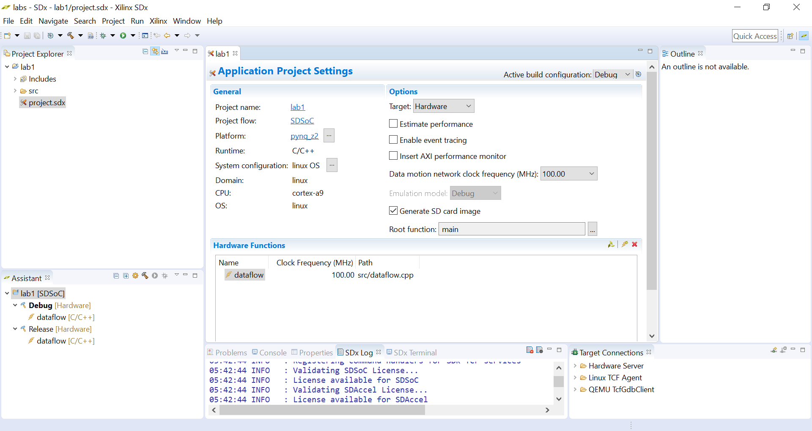
    

    

    <i>Created SDx project</i>
    

### Managing functions to accelerate using various buttons.

1. Notice the dataflow function, is already targeted for hardware acceleration. Also, the data movement frequency selected is 100.00 MHz. You can change the frequency by clicking in the corresponding field and selecting appropriate frequency.

    

    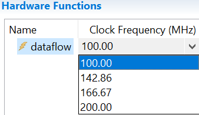
    

    

    <i>Available frequencies</i>
    

1. You can add additional functions by click on the Add HW Functions… () button. When clicked, the source files will be scanned and the available functions in the project will be displayed along with possible candidates.

    

    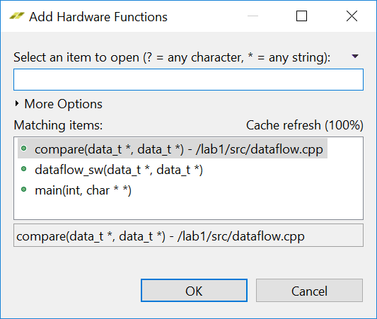
    

    

    <i>Functions in the project</i>
    

1. Click **Cancel** since we do not want to add any other functions.
 	You can remove an already added functions by selecting their corresponding entries and click on the Remove HW Functions () button.

1. In the Assistant view notice the function(s) which is(are) marked for the hardware implementation.

    

    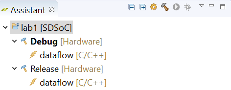
    

    

    <i>The Assistant view</i>
    

## Build the Design with Hardware Accelerators

### Select Release configuration and build the project. When done, analyze the data motion network through the report and built hardware through Vivado IPI.

1. Right-click on lab1 in the Project Explorer and select Build Configurations &gt; Set Active to see possible configurations and what is currently selected.
1. Select Build Configurations &gt; Set Active &gt; Release

	You can also select the configuration by clicking on the drop-down button of the Active build configuration field of the SDx Project Settings pane.

    

    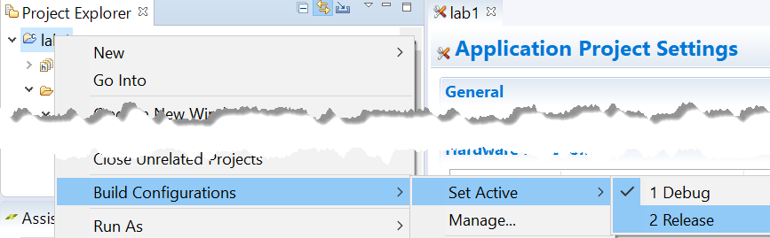
    

    

    <i>Available configurations and selecting them</i>
    

	The Release build configuration uses a higher compiler optimization setting than the Debug build.

	Building the project and generating the results in the next step may take 50 to 60 minutes. Alternatively, you can import provided pre-built files into your workspace and load the results.

1. Right-click on **lab1** and select **Build Project**

	The output from the SDx compiler can be viewed in the Console tab. The functions selected for hardware are compiled into IP blocks using Vivado HLS. The IP blocks are then integrated into a Vivado design based on the selected base platform. Vivado will carry out synthesis, and place and route tools to build a bitstream. The software functions that have been moved to hardware will be replaced by function calls to the hardware blocks, and the software will be compiled to generate an ELF executable file.

	This may take about 50 to 60 minutes.

	You can also load the results by importing the pre-built files into your workspace with these steps:
 
 * Select File &gt; Import and then select General &gt; Existing Projects into Workspace and click Next.
 * Select Select archive file and click Browse to navigate to {labs}\source\lab1
 * Select lab1_prebuilt.zip , and click Open
 * Click Finish.

1. Expand the **lab1** (or **lab1\_prebuilt** if you have imported the project) directory in the _Project Explorer_ tab and observe that _Release_ folder is created along with virtual folders of _Binaries_ and _Archives_. Expanding the _Release_ folder shows **\_sds, sd\_card, src** folders along with **lab1.elf (**(or **lab1\_prebuilt.elf** if you have imported the project) [executable] **, lab1.elf.bit** (or **lab1\_prebuilt.elf.bit** if you have imported the project) [hardware bit file] and several make files.
Generated (b) Imported

    

    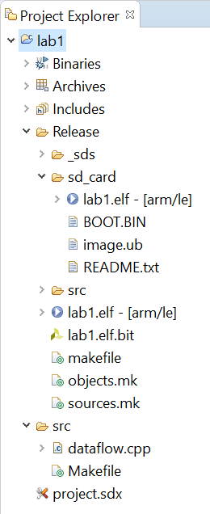
    

    

    <i>Project Explorer folders</i>
    

	The sd_card folder contains files and sub-directory (depending on the target OS) which can be copied to a SD card and then used to boot the system to test the design in hardware.

	The src folder contains object and debug information carrying files of the main function as well as the hardware target files.

	The _sds folder contains various sub-folders and files generated by SDx as well as other underlying used tools.

1. Expand the \_sds folder.

    

    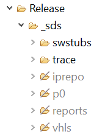
    

    

    <i>The generated _sds folder content</i>
    

	Notice that there are six sub-folders out of which four are greyed-out and two are shown as normal. The directories which are not greyed-out (swstubs and trace), indicate the folders and their contents were generated by SDx. The greyed folders (iprepo, p0, reports, vhls) were generated by the underlying tools.

	The swstubs contains various source files to handle data motion as well as communication with the hardware accelerators. It also contains various stub files and generated libraries.

	The iprepo and vhls folders are generated by Vivado HLS. The iprepo has sub-folders for the hardware function. The vhls folder contains the complete HLS solution for the function. It also contains tcl files used to generate the solution.

	The p0 folder consists of _vpl,_vivado and sd_card sub-folders which includes the Vivado IPI project (synthesis and implementation tcl files and results) and the generated SD card contents. The project file, located in ipi sub-folder, has an extension of xpr. The project can be opened with Vivado to display the block diagram of the generated system-level hardware. The vpl folder has the system.bit and system.hdf files which are used in creating the BOOT.bin file.

	The reports folder consists of log files and the data_motion.html containing the data motion network report.

1. Another pane, **Assistant** , is created below the _Project Explorer_ pane. Expand the **Lab1** entry and see the available html and report files.

    

    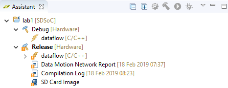
    

    

    <i>The Assistant pane</i>
    

1. In the _Assistant_ pane, double-click on the **Data Motion Network**** Report** entry.

	The report shows the connections made by the SDx environment and the types of data transfers for each function implemented in hardware. You can also open this report file by double-clicking data_motion.html entry in Release &gt; _sds &gt; reports of Project Explorer.

    

    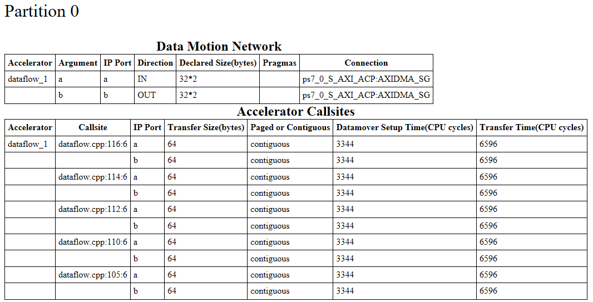
    

    

    <i>Data motion network and accelerator callsites</i>
    

	There is one accelerated function- dataflow. It is given instance name of dataflow_1. The function has two arguments and hence two ports.

	The transfer size is 64 bytes or 32 words on each ports.

1. Start Vivado by selecting **Start \&gt;**  **Xilinx Design Tools**  **\&gt; Vivado 2018.2**

1. Click the **Open Project** link, open the design by browsing to _{labs}/lab1/Release/\_sds/p0/vivado/prj_ and selecting **prj.xpr**.

1. Click on **Open Block Design** in the _Flow Navigator_ pane. The block design will open. Note various system blocks which connect to the Cortex-A9 processor (identified by ZYNQ in the diagram).

    

    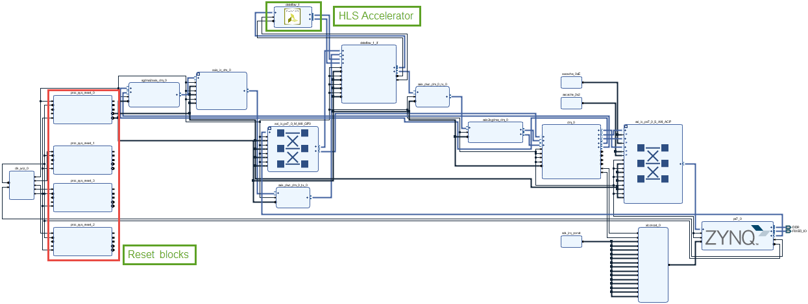
    

    

    <i>The generated block design</i>
    

	As seen before, this platform supports four clocks. There are four reset blocks, one for each clock. As only 100 MHz clock was used for the accelerator, it connects only one reset block (top). The other blocks will be optimized away during the synthesis.

	We have targeted one function for hardware acceleration, and hence one HLS created block is generated and included in the design.

	Notice that there are two data movers (highlighted). The two data movers connect to the processor's ACP interface using the ACP interconnect instance.

    

    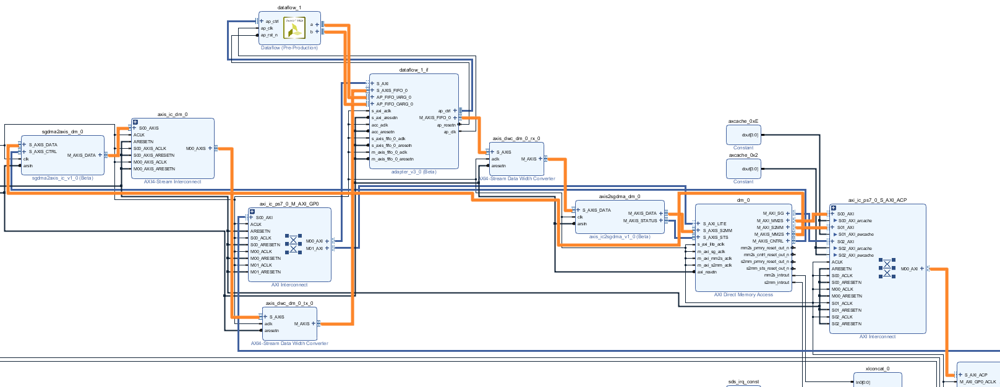
    

    

    <i>Data movers connections</i>
    

1. Close Vivado by selecting **File \&gt; Exit**

### Open the dataflow.cpp file under Release &gt; _sds&gt; swstubs and lab1 &gt; src folders and understand the added code segments.

1. Expand lab1 &gt; src and double-click on dataflow.cpp to see its content.

	If line numbers are not visible, then you can right-click in the left border of the file and select Show Line Numbers.

	Note that line 104 makes the dataflow function call. Lines 109 to 116 makes four additional calls to the dataflow function. The dataflow function is defined between lines 57 and 67.

1. Expand **Release \&gt; \_sds\&gt; swstubs** and double-click on _main.cpp_ to see its content.
Note that the main() function is preceded by five function prototypes (lines 179 to 183) and the functions are defined between lines 70 and 153. On lines 198, 203, 205, 207, and 209 the original calls are replaced.

    

    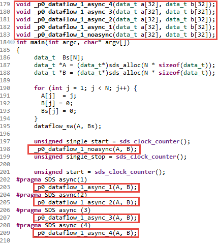
    

    

    <i>Updated dataflow.cpp file content</i>
    

1. Look at the code between lines 57 and 67 which defines the dataflow function.

	The _p0_dataflow_1_noasync function replaces the original functionality with the data transfer using the cf_send command. It additionally uses cf_receive call to get the results, and uses cf_wait for synchronization.

	The subsequent labs will discuss these function calls.

    

    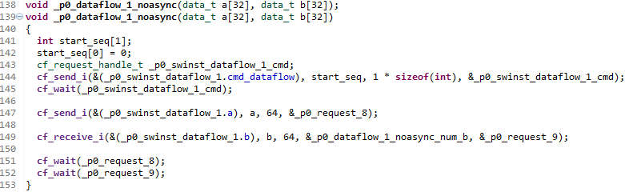
    

    

    <i>The updated mmult.cpp file</i>
    

## Test the Design in Hardware 
### Copy the files located under Release\SD_Card folder into a SD card. Place the card into the board. Configure the board to boot from SD. Connect and power up the board. Establish serial communication. Execute the application.
1. Using the Windows Explorer, copy all the files located under either lab1\Release\SD_Card folder or lab1_prebuilt\Release\SD_Card to the Micro-SD card.
1. Use SDK Terminal window or third party terminal emulator program like PuTTy, HyperTerminal, TeraTerm programs.
1. Select appropriate COM port (depending on your computer) and configure the terminal with the 115200 baud rate.
1. You should see the Linux OS booting and waiting for you to login. Use root as username and password to login.

    

    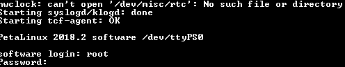
    

    

    <i>System bootup output</i>
    

	If you don't see the output then you can press PS-SRST push-button (Red) on the board.

1. In the Terminal window, either enter **/mnt/lab1.elf** or **/mnt/lab1\_prebuilt.elf** at the command prompt and hit the Enter key.
	The program will be executed, and the result will be displayed showing the number of cycles software execution takes vs the number of cycles taken using the hardware accelerators.

    

    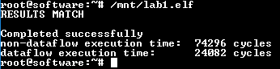
    

    

    <i>Program output</i>
    

1. Close SDx by selecting **File \&gt; Exit**
1. Turn OFF the power to the board.

## Conclusion

In this lab, you created a project in the SDx Development Environment using one of the available project templates. You then identified the functions which you wanted to put in the PL section of the Zynq chip to improve the performance. Once the system was built, you analyzed the Data Motion network and the created Vivado IPI project. Finally, you copied the relevant files on a SD card and verified the design in hardware.