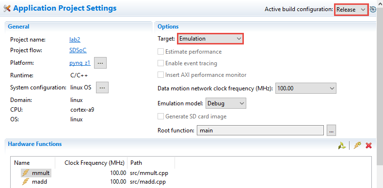
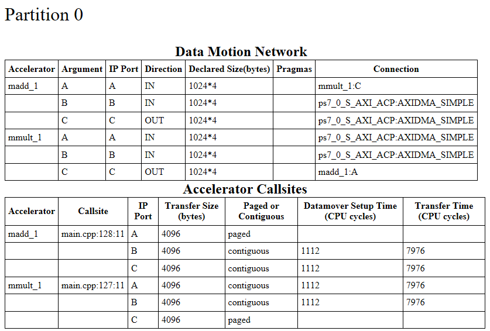
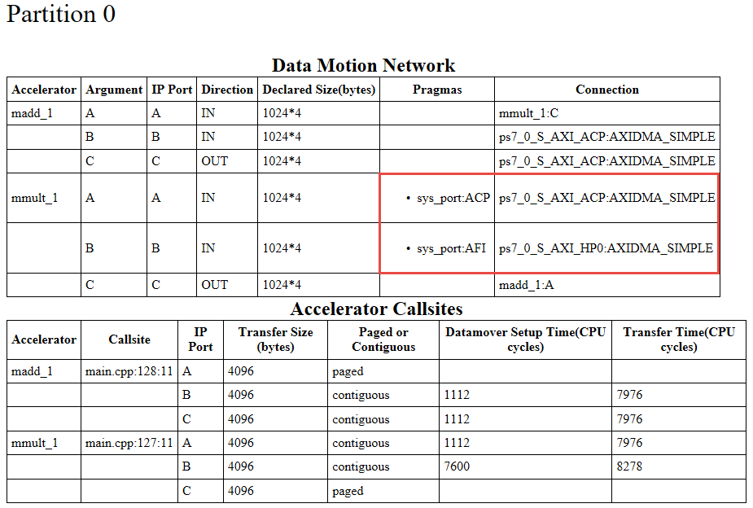
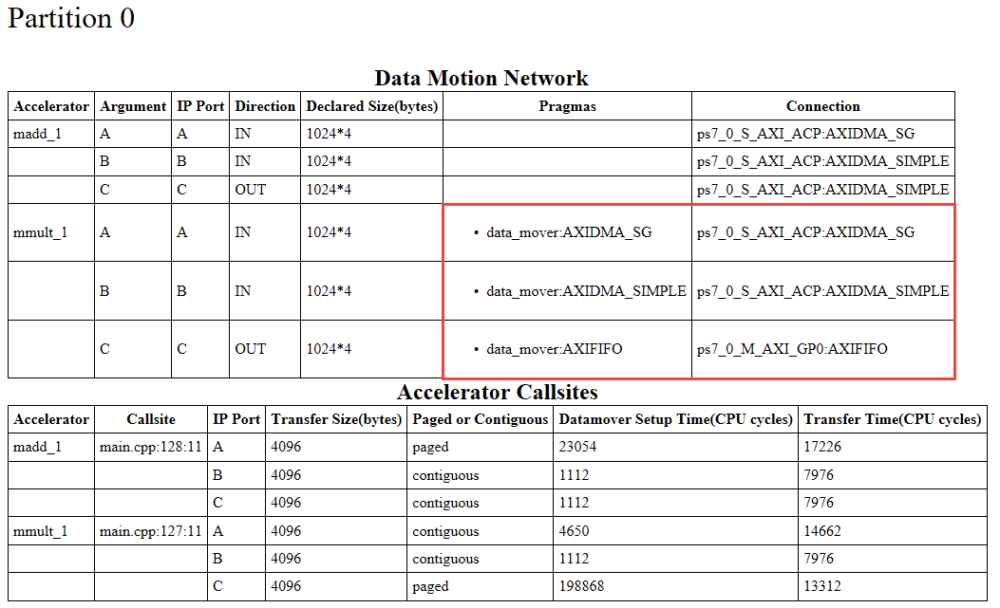
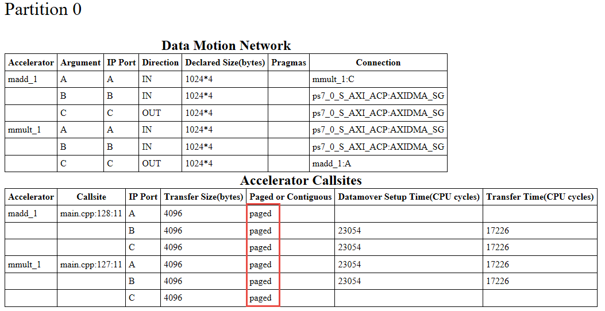

# Pragmas and Data Motion Networks

## Objectives

After completing this lab, you will be able to:

* Use pragmas to select ACP or AFI ports for data transfer
* Use pragmas to select different data movers for your hardware function arguments
* Understand the use of sds_alloc() and sds_free() calls
* Understand the use of malloc() and free() calls
* Understand the data motion network reports

## Steps

## Create an SDx Project Step 1
### Launch SDx and create a project, called lab2, using the matrix-multiply and add template, targeting the PYNQ-Z1 or PYNQ-Z2 board.
1. Open SDx by selecting **Start &gt; Xilinx Design Tools &gt; SDx IDE 2018.2**

	The Workspace Launcher window will appear.

1. Click on the Browse button and browse to **{labs},** if necessary and click **OK**.
1. Click **OK**.

	Click X on the Welcome tab, if displayed, to close it.

1. Select **File &gt; New &gt; Xilinx SDx Project…** to open the New Project GUI.

1. Enter **lab2** as the project name. Click **Next** to see Platform window showing various available platforms.

1. Select either _PYNQ-Z1[custom]_ or _PYNQ-Z2[custom]_ and click **Next.**

	Refer to Lab1 document for how to add custom platform if you don't see it listed.

1. Select _Linux_ as the target OS and click **Next**.

	The Templates page appears, containing source code examples for the selected platform.

1. Select **mmultadd**.
1. Click **Finish**.
	
	The Project Explorer tab will display the lab2 project directory. The lab2 folder also shows the project.sdx file. Double-clicking on it will display what you see in the right-side pane.

	Notice the two functions, mmult and madd, are already targeted for hardware acceleration. Also, the data movement frequency selected is 100.00 MHz.

## Build the Project and Analyze
### Build the project. When done, analyze the data motion network through the report.
1. Select **Build Configurations &gt; Set Active &gt; Release**
1. In the SDx Project Settings pane on right, select Emulation as a target option since we want to explore the generated data motion network.
    

    
    

    

    <i>Selecting Emulation target option</i>
    

1. Right-click on **lab2** and select **Build Project**

	This may take about 10+ minutes.

1. Expand the **lab2** directory in Project Explorer and observe that _Release_ folder is created along with virtual folders of _Binaries_ and _Archives_. Expanding the _Release_ folder shows **\_sds** and **src** folders along with **lab2.elf** (executable) **,** and several make files.
1. In the _Assistant_ pane, double-click on **Data Motion Network Report** link under _lab2 &gt; Release_ to view the Data Motion Network report.

	The report shows the connections made by the SDx environment and the types of data transfers for each function implemented in hardware. You can also open this report file by double-clicking data_motion.html entry in Release &gt; _sds &gt; reports of Project Explorer. This will be used as a reference.

    

    
    

    

    <i>Data motion network and accelerator callsites</i>
    

	There are two accelerated functions- madd and mmult. They are given instance names as madd_1 and mmult_1. Each function has three arguments and hence three ports. Notice that the C port of mmult_1 is directly connected to A port of madd_1 port, whereas the other two ports of each hardware are connected in the system via AXIDMA_SIMPLE channels on ACP.

	The transfer size is 4096 bytes (or 1024 words) on each port of the two accelerators.

## Using sys_port Pragma
### Add sys_port pragma in mmultadd.h file. Build the project and analyze the data motion network.
1. Expand lab2 &gt; src and double-click on main.cpp to see its content.

	If line numbers are not visible, then you can right-click in the left border of the file and select Show Line Numbers.

1. Double-click the _mmultadd.h_file in the Project Explorer view, to open the file in the source editor.

1. Immediately preceding the declaration for the _mmult_ function (line 53), insert the following to specify the system port for each of the input arrays

	\#pragma SDS data sys_port(A:ACP, B:AFI)

	ACP is the default connection type, but it will be specified explicitly for A. B will have an AFI type which will connect it to one of the PS7 HP ports.

1. Save the file by selecting **File &gt; Save**
1. Right-click the top-level folder for the project and click on **Clean Project** in the menu.
1. Right-click the top-level folder for the project and click on **Build Project** in the menu.
1. When build process is done, select the **Assistant** pane so you can access Data Motion link.
1. Double-click on the **Data Motion**  **Network Report** link and analyze the result.

    

    
    

    

    <i>Data Motion network after applying sys_port pragma</i>
    

	Compared to the referenced output we saw earlier, observe that the Pragmas column has two sys_port entries for the mmult_1 instance. The same column shows that A port is connected to ACP whereas B is connected to AFI (HPx). The connections are made to the S_AXI_ACP and S_AXI_HP0 ports of the PS7. The AXIDMA_SIMPLE transfer is also selected.

## Using data_mover Pragma
### Comment out the sys_port pragma and add data_mover pragma in the mmultadd.h file. Build the project and analyze the data motion network.
1. Double-click the mmultadd.h under lab2 &gt; src.
1. Comment out the pragma that you had inserted in the previous section.
1. Add the following pragma statement above the mmult function declaration.

	\#pragma SDS data data_mover(A:AXIDMA_SG, B:AXIDMA_SIMPLE, C:AXIFIFO)

1. Save the file by selecting **File &gt; Save**
1. Right-click the top-level folder for the project and click on **Clean Project** in the menu.
1. Right-click the top-level folder for the project and click on **Build Project** in the menu.
1. When build process is done, select the **Assistant** pane so you can access Data Motion link.
1. Double-click on the **Data Motion**  **Network Report** link and analyze the result.

    

    
    

    

    <i>Data Motion network after applying data_mover pragma</i>
    

	Compared to the referenced output we saw earlier, observe that Pragmas columns has three data mover entries for the mmult_1 instance. The same column shows that A port is using AXIDMA_SG data mover, B is using AXIDMA_SIMPLE data mover, and C is using AXIFIFO data mover. The connection column indicates that A and B are connected to ACP whereas C is connected to GP0 of the PS7.

## Using malloc()
### Comment out the data_mover pragma in mmultadd.h file. Replace sds_alloc and sds_free calls with malloc and free calls in the main.cpp file. Build the project and analyze the data motion network.

### The sds_alloc() call uses a single physical memory space which may or may not be available in Linux OS. The sds_alloc() call uses simple DMA data mover. Linux OS can translate contiguous virtual address into multiple physical address ranges. In Linux OS, malloc() can be used to enable single virtual address space mapping to multiple physical address space segments however it must use Scatter Gather (SG) DMA. Memory allocated using sds_alloc call must be released using sds_free call whereas memory allocated using malloc must be freed using free calls.

1. Double-click the **mmultadd.h** under _lab2 &gt; src_.
1. Comment out the pragma for _data\_mover_ that you had inserted in the previous section and save the file.
1. Save the file by selecting **File &gt; Save**
1. Double-click the **main.cpp** under _lab2 &gt; src_.
1. Replace 4 _sds\_alloc()_ calls with _malloc()_ and 8 _sds\_free_ calls with _free()(CTRL+F to access Find and Replace)_ and save the file.
1. Right-click the top-level folder for the project and click on **Clean Project** in the menu.
1. Right-click the top-level folder for the project and click on **Build Project** in the menu.
1. When the build process is complete, select the **Assistant** pane so you can access Data Motion link.
1. Click on the **Data Motion**  **Network Report** link and analyze the result.

    

    
    

    

    <i>Data Motion network using malloc and free function calls</i>
    

	Compared to the referenced output we saw earlier, observe that Paged or Contiguous column has paged type of data movement instead of contiguous. The Connection column shows AXIDMA_SG on S_AXI_ACP.

1. Close SDx by selecting **File &gt; Exit**

## Conclusion

In this lab, you used various pragmas to control the generated data motion network and number of data movers. You used sys_port and data_mover pragmas and observed the type of ports used. You also used malloc() and free() calls instead of sds_alloc() and sds_free() calls to handle the non-contiguous memory usage.