# Profiling Applications and Creating Accelerators

## Objectives

After completing this lab, you will be able to:

* Use TCF profiler to profile a pure software application
* Use TCF profiler to profile a software application that calls functions ported to hardware
* Use manual profiling method by using sds_lib API and counters

## Steps

## Create an SDx Project
### Launch SDx and create a project, called lab3, using the Empty Application template and then using the provided source files, targeting the PYNQ-Z1 or PYNQ-Z2 board.
1. Open SDx, select {labs} as the workspace and click **OK**.
1. Create a new project called **lab3**
1. Click **Next** to see Platform window showing various available platforms
1. Select either _PYNQ-Z1[custom]_ or _PYNQ-Z2[custom]_ and click **Next**.

	Refer to Lab1 document for how to add custom platform if you don't see it listed.

1. Select **Standalone OS** as the _System Configuration_ and click **Next**.

	The Templates page appears, containing source code examples for the selected platform.

1. Select **Empty Application** and click **Finish**.

	Note that the lab3 &gt; src folder is empty.

### Import the provided source files from the {source}\lab3\src folder. Create a Debug configuration and build the project.
1. Right click on src under lab3 in the Project Explorer tab and select **Import…**
1. Click on **File System** under the _General_ category and then click **Next**.

    

    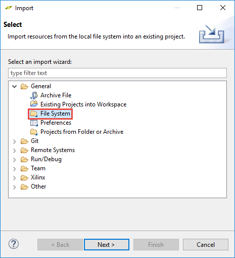
    

    

    <i>Selecting import source location</i>
    

1. For the _From Directory_, click on the **Browse** button and browse to _{source}\lab3\src_ folder and click **OK**.
1. Either select all the files in the right-side window or select _src_ checkbox in the left-side window and click **Finish** to import the files into the project.

	The files will be copied into the src folder under lab3 folder. This can be verified by expanding the src folder in the Project Explorer tab and by using Windows Explorer.

    

    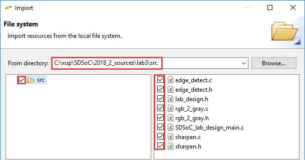
    

    

	<i>Selecting path and files to be imported</i>
    

1. Uncheck the **Generate SD card image** option
1. Select **Build Configurations &gt; Set Active &gt; Debug**
1. Right-click on **lab3** and select **Build Project**

	This may take about five minutes as it is a pure software compilation.

## Profile the Application
### Connect the board in the JTAG mode and power it ON. Start the Debug session. Add the TCF Profiler view and configure it to include the Aggregate per Function option.
1. Connect the board in the JTAG mode and power it ON.
1. Right-click on the _lab3_ entry in the Project Explorer tab and select **Debug As &gt; Launch on Hardware (SDx Application Debugger)**
    

    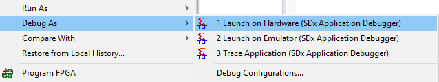
    

    

	<i>Executing Debug Application</i>
    

	A Confirm Perspective Switch window will appear asking you to switch to the Debug perspective.

    

    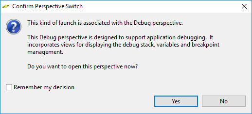
    

    

	<i>Perspective Switch dialog window</i>
    

1. Click **Yes** to open the debug perspective.

	The debug perspective will open showing various views: threads, variables, SDSoC_lab_design_main.c source program, Outline tab showing various objects created in the source program, and the console.

	Notice that the program is suspended at the main() entry on line 68.

    

    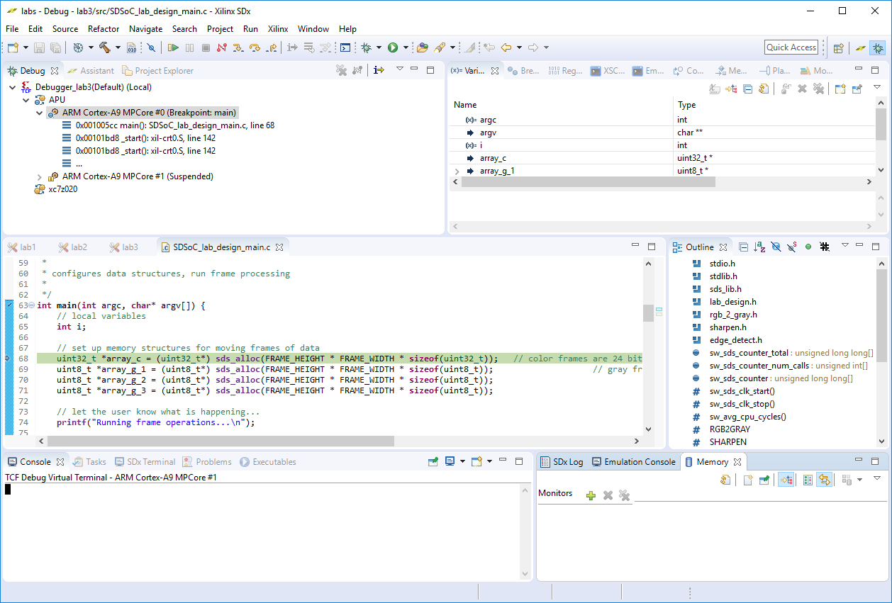
    

    

	<i>The Debug perspective</i>
    

1. Select **Window &gt; Show View &gt; Other** and then expand the _Debug_
1. Select _TCF Profiler_ and click **OK**.

	The TCF Profiler tab will open in the same window where Outline view was open.

1. In the _TCF Profiler_ view, click the start button.
    

    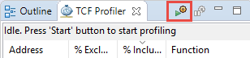
    

    

	<i>Opening the TCF Profiler configuration</i>
    

	The Profiler Configuration window will open.

1. Leave _Aggregate per function_ selected, select the _Enable stack tracing_ option and click **OK**.

	The Aggregate per function option will group the same function calls collected together.

	The Enable stack tracking option implements thread stack back tracing - essentially a summary of how the program execution gets to where it is when sampled. This allows the determination of parent/child relationships between functions.

	The Max stack frames count field sets the number of frames to count backwards. This option is useful only if the Enable stack tracing is enabled.

	The View update interval (msec) field indicates at what interval the profile data will be updated in the TCF Profiler window.

    

    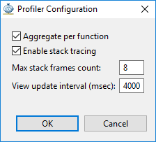
    

    

	<i>Selecting the options</i>
    

1. Click **OK**.
### Run the application and analyze the data.
1. Click on the Resume button (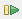) on the tool buttons bar or Press F8 to start the execution.

1. Note the number of collected samples may vary, when finished execution, depending on your PC's performance and connection speed with the board.
    

    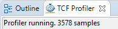
    

    

	<i>The TCF Profiler view showing the collected number of samples</i>
    

1. Click on the Maximize view button (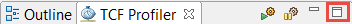).

	Note that it shows three sections. The top-section shows various calls made after the execution started. The first function called is _start. In the Called From sub-window, nothing is listed as it the root function. In the Child Calls window, it shows main as the function being called from _start.

    

    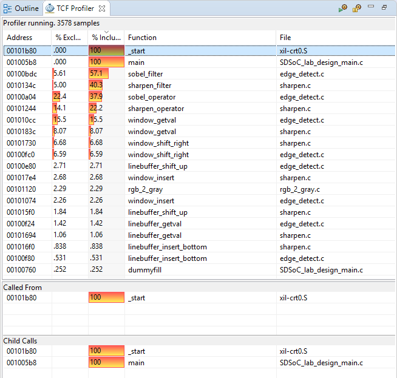
    

    

	<i>The TCF Profiler result</i>
    

	Address is the location of the function in memory that will match whatis shown in the Disassembly view.

	% Exclusive is the percentage of samples encountered by the profiler for that function only (excluding samples of any child functions). This can also be exclusive percentage for that particular function.

	% Inclusive is the percentage of samples of a function, including samples collected during execution of any child functions.

	Function is the name of the function being sampled.

	File is the name of the file containing the function.

	Line indicates the line number where the function is found in the source file.

    

    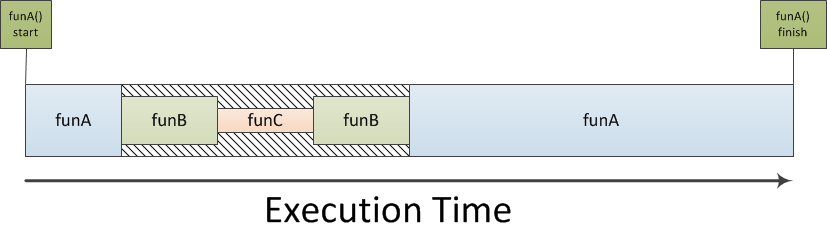
    

    

	<i>Understanding exclusive vs inclusive execution time</i>
    

	Exclusive: The amount of execution time spent in funA alone. Referencing the diagram below, the exclusive time for funA is represented by the combined execution time of the funA blocks only.

	Inclusive : The amount of execution time spent in funA and all of its sub-function calls. From the diagram, this is the exclusive time of funA combined with the hatched area during which time funB and funC are executing

    

    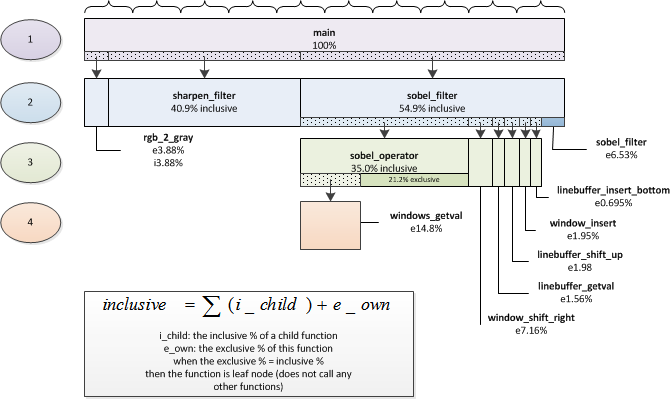
    

    

	<i>Various functions execution times (numbers may vary)</i>
    

1. Note that _\_start_ and _main_ functions are 100% under the **%inclusive** column as all other functions are called from _main_. They are essentially 0% under the **%exclusive** column as a negligible time spent in those functions.
1. Looking under the **%inclusive** column, notice that the CPU spent about 40.3% of its time executing the _sharpen\_filter_ function and its sub-functions.
1. Click on the _sharpen\_filter_ entry to see that the source code window shows up.

	You can view the source code and see that it processes some data and calls several functions.

1. Switch back to the _TCF Profile_ result window and observe that the _sharpen\_filter_ function calls _sharpen\_operator, window\_shift\_right, linebuffer\_shift\_up, window\_insert , linebuffer\_getval,_ and _linebuffer\_insert\_bottom_ functions.

	The same Child Calls window shows how much time the CPU spent in each of those functions.

    

    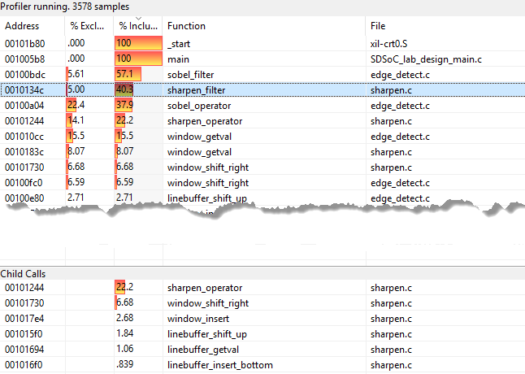
    

    

	<i>Child Calls from sharpen_filter function</i>
    

1. Looking at the results sorted in the **%inclusive** column, we can see that _sharpen\_filter_ may be a good candidate for the hardware acceleration. The function and sub-functions should be carefully considered to determine suitability for acceleration. Typical candidates for acceleration are functions that can process a stream of data, or can be implemented in parallel, without excessive resource utilization.
1. Click on the **%Exclusive** column to sort the results.
You can see that the CPU spends a large proportion of the total time in the sharpen_operator function. This may be a good candidate for acceleration.

1. Click on the Disconnect button () to terminate the session.

## Accelerate sharpen_filter and Profile
### Add sharpen_filter function for hardware acceleration. Change SDSCC compiler setting to define TIME_SHARPEN symbol. Build the project and analyze the data motion network.
### Since this will take time to build, you will import lab3a project from the source\lab3 folder and then profile the application. The precompiled project has sharpen_filter already added for hardware with the compiler setting added.

Skip to [Continue building the project](#sec3-2) if you are continuing to build the project

1. Switch back to the SDx perspective.
1. Select **File &gt; Import**
1. Double-click on _Import Existing Projects into Workspace_.
1. In the _Import Projects_ window, click on the _Select archive file_ option, then click the **Browse** button and then browse to _{source}\lab3_, select _lab3a.zip_ and click **Open**.

	Make sure that lab3a is checked in the Projects window.

    

    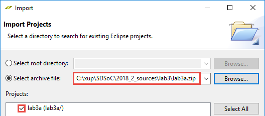
    

    

	<i>Importing an existing project in the workspace
</i>
    

Skip to [Analyze Data Motion Network](#AnalyzeDataMotionNetowrk)

### Continue building the project.
1. Switch back to the SDx perspective by clicking ()

	Make sure that the Project Overview tab for the lab is displayed.

1. Click on the "+" sign in the Hardware Functions area to open the list of functions which are in the source files (It may take little longer to show up).

1. Select _sharpen\_filter_ function and click **OK**.
1. Double-click the _SDSoC\_lab\_design\_main.c_ under lab3 &gt; src.
1. Note several conditional compilation statements around lines 83 to 103. 

	When a symbol is defined, and the condition is true, these statements will allow the corresponding function(s) to be timed.
1. Right click on lab3 in the Project Explorer window and select C/C++ Build Settings.
1. Select **Symbols** under SDSCC Compiler and click "+" button to define a symbol.
1. Enter **TIME_SHARPEN** in the field and click **OK**.
1. Click **OK** again.

    

    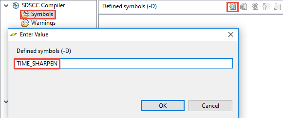
    

    

	<i>Defining symbol for conditional compilation</i>
    

1. Select _Hardware_ as a Target and check _Generate SD card image_ option.
1. Right-click the top-level folder for the project and click on **Clean Project** in the menu.
1. Right-click the top-level folder for the project and click on **Build Project** in the menu.
This may take about 40 minutes.

1. When build process is done, select the **lab3** tab so you can access Data Motion link.

### Analyze the data motion network.
1. Click on the Data Motion report link and analyze the result.
    

    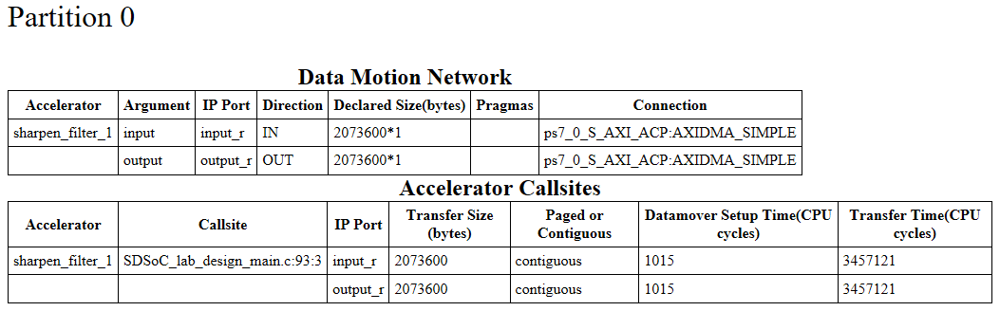
    

    

	<i>Data Motion network</i>
    

### Open Vivado IPI design.
1. Open Vivado by selecting **Start &gt; Xilinx Design Tools &gt; Vivado 2018.2**
1. Open the design by browsing to {labs}/lab3/Debug/_sds/p0/vivado/prj if you continued building the project or {labs}/lab3a/Debug/_sds/p0/vivado/prj if you have imported the project and selecting **prj.xpr**.
1. Click on Open Block Design in the Flow Navigator pane. 

	The block design will open. Note various system blocks which connect to the Cortex-A9 processor (identified by ZYNQ in the diagram).
1. Click on the show interface connections only () button followed by click on the regenerate layout () button.
1. Follow through both input and output data paths of the sharpen_filter_1 instance and observe that they are connected to the S_AXI_ACP port of PS7.
    

    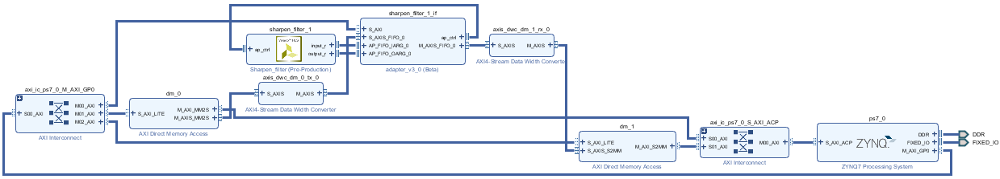
    

    

	<i>Built design</i>
    

	Notice that two data movers are used; one for input and another for output data. They both connect to S_AXI_ACP of PS7 through the axi_ic_ps7_S_AXI_ACP instance. The two data movers and the sharpen_filter_1_if instance can be configured by their S_AXI_LITE interfaces which are connected to the ps7 via the axi_ic_ps7_M_AXI_GP0 instance.

1. Close Vivado by selecting **File &gt; Exit.** Do not save the block design.
### Connect the board and power it ON. Start the Debug session. Add the TCF Profiler view and configure it to include the Aggregate per Function option.
1. Connect the board and power it ON.
1. Right-click on the lab3 (lab3a if you have imported the project) entry in the Assistant tab and select Debug As &gt; Launch on Hardware (SDx Application Debugger)
1. Click Yes to open the debug perspective, if prompted.
Notice that the program is suspended at the main() entry on line 75 (instead of 68 in Figure 5).

	If you scroll up into the main() function window, you will notice code is added on lines 63 to 69 which declares _p0_sharpen_filter_1_noasync function prototype.

    

    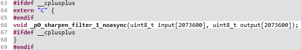
    

    

	<i>Function prototype for the accelerated function</i>
    

1. Add _TCF Profiler_ view as before and configure the TCF Profiler view to include the _Aggregate per function_ option.
### Run the application and analyze the data.
1. Press the Start button of the TCF Profiler.
2. Change the update interval setting to 1000 since we want to collect samples at finer resolution.
    

    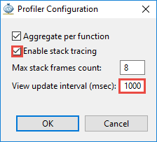
    

    

	<i>Setting update interval to 1 second (1000 msec)</i>
    

1. Click on the **Resume** button (Green box) on the tool buttons bar to start the execution.
1. Wait for the execution to complete.
Note that the number of collected samples may vary depending on your PC's performance and connection speed with the board.

    

    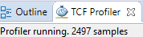
    

    

	<i>The TCF Profiler view showing the collected number of samples</i>
    

1. Click on the **Maximize** view button.
    

    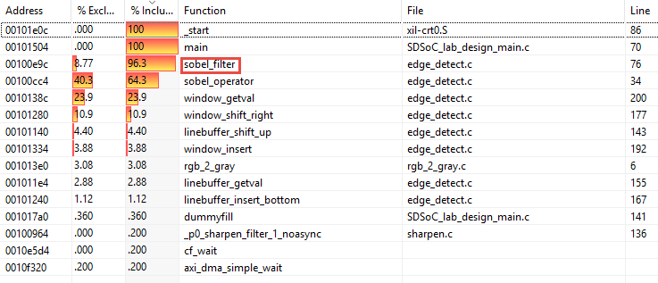
    

    

	<i>The TCF Profiler result</i>
    

	Note that _start and main functions are 100% under the %inclusive column as all other functions are called from main. Now the CPU spent most of its time executing the sobel_filter function and its sub-functions. You don't see _p0_sharpen_filter_1 call (the hardware accelerator) since very little time is spent in that function.

1. Click on the **Disconnect** button to terminate the execution.

## Profiling Using sds_lib API
### Re-launch the application in the Debug perspective. Start the terminal session and run the application to the end.
1. In the Debug view, right-click on the disconnected entry and select Relaunch.
    

    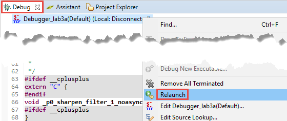
    

    

	<i>Re-launching the debugger</i>
    

1. Click on the SDK _Terminal_ window and make a connection with an appropriate COM port OR use any other terminal emulator program like TeraTerm, Putty, HyperTerminal. Choose **115200** as the baud rate.
1. Click on the **Resume** button.
1. You will see dots being displayed as the execution is continuing. You will also see progress is made in the TCF Profiler view.

	Wait for about one minute to complete the execution and the result is displayed in the Terminal window.

    

    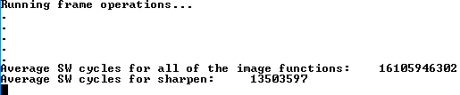
    

    

	<i>The sharpen function profiling</i>
    

1. Click on the **Disconnect** button.

## Add sobel_filter to Accelerators and Profile
### Add sobel\_filter function for hardware acceleration. Change SDSCC compiler setting to define TIME\_EDGE\_DETECT symbol. Build the project.
### Since this will take time to build, you will import lab3b project from the {source}\lab3 folder and then profile the application. The pre-compiled project has both the sharpen\_filter and sobel\_filter already added for hardware with the compiler setting added.

1. Switch back to the SDx perspective.
1. Select **File &gt; Import**
1. Double-click on _Import Existing Projects into Workspace_.
1. In the _Import Projects_ window, click on the _Select archive file_ option, then click the **Browse** button and then browse to _{source}\lab3_, select _lab3b.zip_ and click **Open**.

	Make sure that lab3b is checked in the Projects window.

1. Click **Finish**.

	The project will be imported and the sobel_filter and sharpen_filter function entries will be displayed in the HW Functions window.

1. Double-click on the **project.sdx** under _lab3b_ to access the _SDx Project Settings_.
1. Right Click on the **lab3b** project folder, select **Debug As** , and **Launch on Hardware**
1. Click **Yes** to switch to the debug perspective if prompted.
1. Select **Window &gt; Show View &gt; Other** and then expand the _Debug_ Select _TCF Profiler_ and click **OK**.
1. In the _TCF Profiler_ view, click the start button, enable the _Aggregate per function_ option and _Enable stack tracing_. Click **OK**.
### Start serial communication. Profile the complete application and observe the improvements.
1. Connect a terminal as before. (Terminal Tab, TeraTerm, PuTTY, HyperTerminal etc.)
1. Click on the Resume button.
1. You will see dots being displayed as the execution progresses. You will also see progress is made in the TCF Profiler view.

	The execution should complete in under a minute and the result is displayed in the Terminal window.

    

    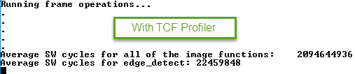
    

    

	<i>The sharpen and sobel filter functions profiling</i>
    

1. Switch to the TCF Profiler tab and see the results.
Note that now CPU spends time in rgb_2_grap function. The _p0_sobel_filter_0 takes very little time and you don't see the _p0_sharpen_filter_0 entry does not appear at all since it's execution time is so short that the profiler does not see it.

    

    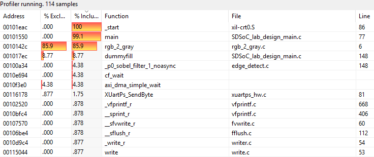
    

    

	<i>Profiled data</i>
    

1. Click on the **Disconnect** button to terminate the execution.
### Profile the application without running the profiler and compare the result.
1. In the Debug view, right-click on the disconnected entry and select Relaunch
1. This time do not click on the start button of the TCF Profiler.
1. Click on the Resume button.
1. You will see dots being displayed quickly as the execution is continuing.
1. Notice the terminal output.
    

    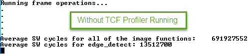
    

    

	<i>The terminal window output</i>
    

	Compared to output with the profiler running, the execution takes significantly fewer cycles.

1. Click on the **Disconnect** button to terminate the execution.
1. Close SDx by selecting **File &gt; Exit**
1. Turn OFF the power to the board.

##Conclusion

In this lab, you profiled a pure software application which consist of three major functions. You saw the amount of time those three functions took to execute. Then you ported one of the most time-consuming function into hardware and profiled again. You then ported second most time-consuming function into hardware and profiled again and observed the performance improvement. You used the TCF profiler and sds_lib API to collect the data.