#Estimating Accelerator Performance and Events Tracing

## Objectives

After completing this lab, you will be able to:

* Use the SDx environment to obtain an estimate of the speedup that you can expect from your selection of functions to accelerate
* Differentiate between the flows targeting Standalone OS and Linux OS
* Track various events taking place with respect to hardware accelerators

## Steps

## Create an SDx Project 
### Launch SDx and create a project, called lab4, using the Empty Application template and then using the provided source files, targeting the PYNQ-Z1 or PYNQ-Z2 board and Standalone OS.
1. Open SDx, select {labs} as the workspace and click OK.
2. Create a new project called lab4
3. Click Next to see Platform window showing various available platforms.
4. Select either PYNQ-Z1[custom] or PYNQ-Z2[custom] and click Next.

	Refer to Lab1 document to how to add custom platform if you don't see it listed.

5. Select **Standalone** as the target OS and click **Next**.
6. Select **Empty Application** and click **Finish**.
### Import the provided source files from {source}\lab4\src folder.
1. Right click on src under lab4 in the Project Explorer tab and select Import…
2. Click on File System under General category and then click Next.
3. Click on the Browse button, browse to {source}\lab4\src folder, and click OK.
4. Either select all the files in the right-side window or select src checkbox in the left-side window and click Finish to import the files into the project.

## Performance Estimation Targeting Standalone 
### Mark sharpen_filter for the hardware acceleration. Run an initial performance estimate of the hardware only.
1. Click on the "+" sign in the HW Functions area to open the list of functions which are in the source files.
2. Select the sharpen_filter function and click OK.
3. Set the Clock Frequency to 100 MHz.
4. In Options panel of the SDx Project Settings pane, click on Estimate Performance checkbox.

	This selects the Estimate build configuration and performs the estimation flow.

    

    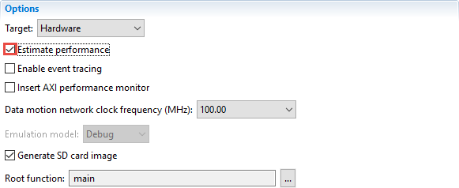
    

    

    <i>Selecting Estimate performance option</i>
    

5. Select **Build Configurations \&gt; Set Active \&gt; Debug**
6. Right-click on **lab4** and select **Build Project**.

	The SDx environment builds the project. A dialog box displaying the status of the build process appears.

7. After the build is over, you can see an initial report.
 
	This report contains a hardware-only estimate summary which is calculated from the hardware compilation. There is a link that can be clicked to run the software on the board and obtain the software performance results. Clicking this link will also update the report with an estimated comparison of hardware accelerated implementation versus the software-only information.

    

    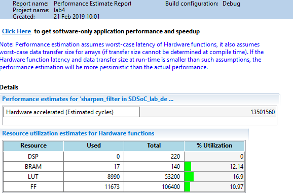
    

    

    <i>Initial estimate of hardware only performance</i>
    

### Connect and power up the board. Click on the Click Here link of the initial estimation report to run the application and get the entire application speedup.
1. Connect the board and power it ON.
2. Click on the Click Here link in the SDSoC Report Viewer tab to get the software only application performance and speedup.

	Since the board is connected using JTAG and the OS is Standalone, the Local connection will be used.

    

    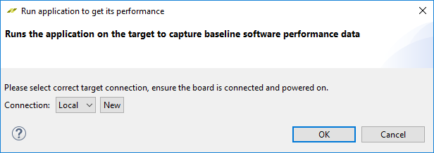
    

    

    <i>Making connection to download and running application</i>
    

3. Click **OK**.

	A default bitstream (without the accelerator functionality) and the application will be downloaded and executed.

    

    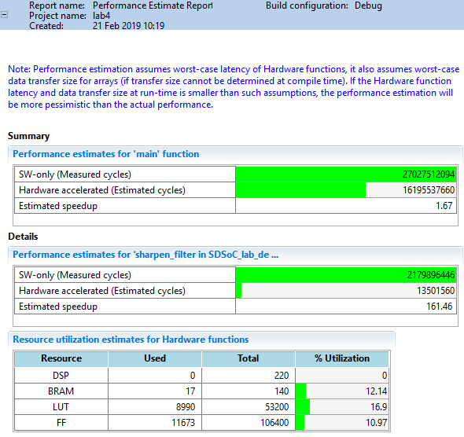
    

    

    <i>Comparison between the pure software and hardware accelerated</i>
    

	The Summary section shows that the estimated speedup between the software only and one with the hardware accelerator is 1.67

### Add sobel_filter for the hardware acceleration. Run an initial performance estimate of the hardware only.
1. Add the sobel_filter function to the accelerator list with 100 MHz Clock Frequency.
2. Select lab4 &gt; Clean Project
3. Right-click on lab4 and select Build Project.

	The SDx environment builds the project. A dialog box displaying the status of the build process appears.

4. After the build is over, the initial estimate and resources report will be displayed again.

    

    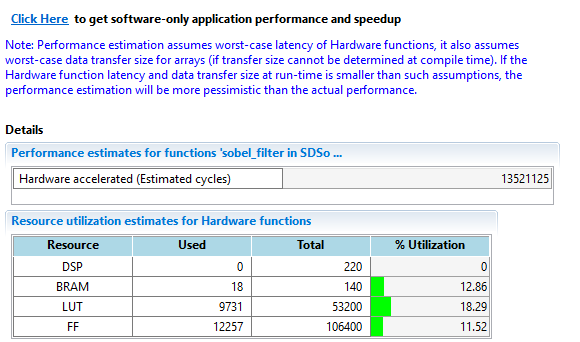
    

    

    <i>Initial hardware acceleration estimate for the two functions</i>
    

5. Click on the **Click Here** link in the SDSoC Report Viewer tab and click **OK**.

    

    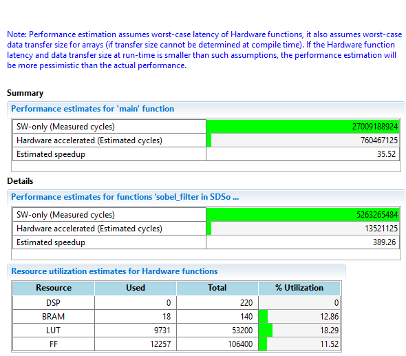
    

    

    <i>Actual performance estimation with two functions in hardware</i>
    

## Performance Estimation Targeting Linux
### Create a new empty application project called lab4a targeting Linux OS. Import the provided source files from source\lab4\src folder
### For this portion of the lab, you will need an Ethernet port on the PC configured with 192.168.0.1 as an IP address and an Ethernet cable.

1. Select **File \&gt; New \&gt; SDx Project** to open the New Project GUI.
2. Enter **lab4a** as the project name.
3. Click **Next** to see _Platform_ window showing various available platforms.
4. Select either _PYNQ-Z1[custom]_ or _PYNQ-Z2[custom]_ and click **Next.**
5. Select **Linux** as the target OS and click **Next**.
6. Select **Empty Application** and click **Finish**.
7. Right click on _src_ under **lab4a** in the Project Explorer tab and select **Import…**
8. Click on **File System** under _General category_ and then click **Next**.
9. Click on the **Browse** button, browse to _{source}\lab4\src_ folder, and click **OK**.
10. Either select all the files in the right-side window or select _src_ checkbox in the left-side window and click **Finish** to import the files into the project.

### Mark sharpen_filter for the hardware acceleration. Run an initial performance estimate of the hardware only.

1. Click on the "+" sign in the HW Functions area to open the list of functions which are in the source files.
2. Select the sharpen_filter function and click OK.
3. Set the Clock Frequency to 100 MHz.
4. In Options panel of the SDx Project Settings pane, click on the Estimate Performance checkbox.
5. Right-click on lab4a and select Build Project

	This selects the Debug build configuration and performs the estimation flow.

6. After the build is over, you will see an initial report.
### Copy the sd_card contents to the SD Card. Configure the board to boot from SD card. Connect and power up the board. Configure the board's Ethernet address to 192.168.0.10 and the PC's to 192.168.0.1
1. Configure the board to boot from SD card.
2. Using the Windows Explorer copy the content of the lab4a &gt; Debug &gt; sd_card onto the (micro) SD card. Insert the SD card into the board.
3. Connect the board, including network cable, and power it ON.

	The board will boot. Make a serial connection using the appropriate COM port.

4. Press the _PS-SRST_ button on the board to reboot and notice Linux booting.
5. Once the board boot is complete, set the IP address of the board to 192.168.0.10 by typing the following command at the Linux prompt:

	_ifconfig_

	Note if any address is being assigned.

	If not assigned then execute the following command to assign to the correct Ethernet adaptor.

    

    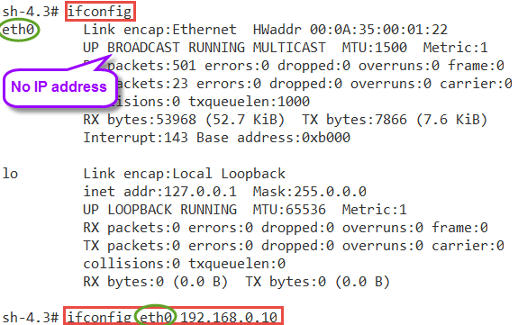
    

    

    <i>Assigning an IP address</i>
    

6. Configure the Ethernet adapter IP address on the Zynq board to 192.168.0.10

	_ifconfig eth0 192.168.0.10_

7. Configure the PC Ethernet adapter IP address to 192.168.0.1
8. Expand Linux TCF Agent in the Target Connection tab.

    

    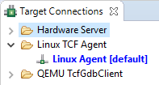
    

    

    <i>Configuring the Linux TCF Agent</i>
    

9. Double-click on the **Linux Agent [default]** entry to open the connection form.
10. Set the _Host IP_ address to **192.168.0.10** , the _Port_ field to **1534,** and then click **OK**.

    

    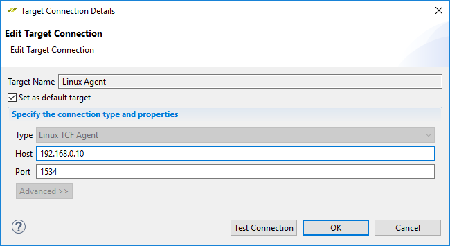
    

    

    <i>Making connection for Linux target</i>
    

### Estimate the accelerator speedup.
1. In the performance and resource estimate report, click on the Click Here link. Click OK to launch the Linux TCF agent.
2. When the execution completes the performance estimate report will be displayed in the SDSoC report viewer.

    

    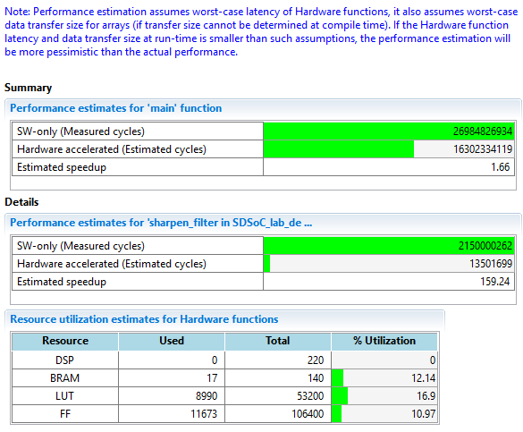
    

    

    <i>Performance estimation targeting Linux OS</i>
    

	Note that the number of SW-only cycles have increased compared to Figure 4. This is due to the overhead running in Linux.

## Tracing Accelerator Events Activities
### Import the provided prebuilt lab4b project from c:\xup\SDSoC\source\lab4. Analyze the SDx Project Settings content.
1. Select File &gt; Import and then select General &gt; Existing Projects into Workspace and click Next.
2. Select Select archive file and click Browse to navigate to c:\xup\SDSoC\source\lab4
3. Select lab4b.zip, and click Open.
4. Click **Finish**.
5. Double-click project.sdx under the lab4b folder to view the SDx Project Settings pane.

	Note that the Enable event tracing option is checked and the rgb_2_gray function operating at 100 MHz is included in the HW functions pane. The project was created targeting Standalone OS.

    

    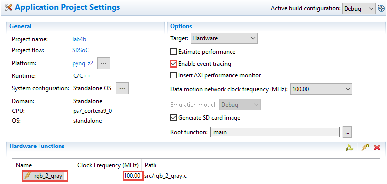
    

    

    <i>Pre-built project with event tracing feature enabled</i>
    

6. Uncheck** the _Generate SD card image_ check box as it is already generated in the imported project.
### Analyze the source code with the tracing code included in the sharpen_filter stub.
1. Open SDSoC_lab_design_main.c from the {_labs}\lab4b\Debug_sds\swstubs_directory.
2. Change the number of times the algorithm loops over is changed from 5 to 1.

	This is to reduce the amount of trace data collected and to give a better view of state analysis.

    

    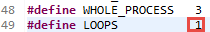
    

    

    <i>Loop iteration changed to 1</i>
    
	
	
	Notice that the call to the _rgb\_2\_gray_ is replaced by the call to the stub.

    

    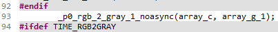
    

    

    <i>Hardware function call</i>
    

3. Double-click on the **rgb\_2\_gray.c** entry under the _Debug/\_sds/swstubs_ directory and notice the actual call is updated.

    

    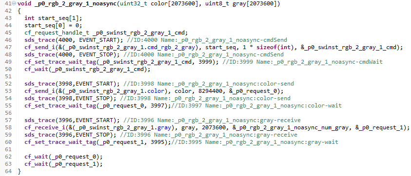
    

    

    <i>The rgb_2_gray function having sds_trace function calls</i>
    

	The stub function initializes the hardware accelerator, initiates any required data transfers for the function arguments, and then synchronizes hardware and software by waiting at an appropriate point in the program for the accelerator and all associated data transfers to complete.

	Event tracing provides visibility into each phase of the hardware function execution, including the software setup for the accelerators and data transfers, as well as the hardware execution of the accelerators and data transfers.

	The above code is instrumented for trace. Each command that starts the accelerator, starts a transfer, or waits for a transfer to complete is instrumented (sds_trace(xxxx, EVENT_START | EVENT_STOP); ).

### Run the application and collect the trace data.
1. Connect and power ON the board.
2. Right-click on the lab4b project and select Run As &gt; Trace Application (SDx Application Debugger)****.

	This will download the bitstream, then the application and finally run the application.

	Notice in the SDx Log tab that the trace data is exported.

    

    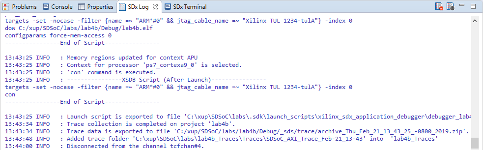
    

    

    <i>Exporting trace data</i>
    

	When the trace data export is completed, the tool will create a trace folder named lab4b_Traces in the Project Explorer tab.

	A new tab, AXI State View, is created next to the Memory tab.

### View the AXI State to analyze the application flow.
1. Expand the lab4b_Traces project folder in the Project Explorer tab .
2. Expand all the folders under the Traces[1] folder.

    

    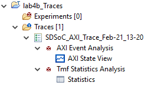
    

    

    <i>Trace Project Folder</i>
    

3. Click on the Home button in the **AXI State View** tab.

	This will show the entire trace history. You will notice

    

    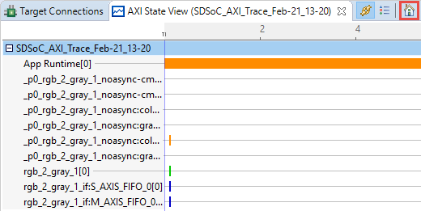
    

    

    <i>Trace Visualization Highlighting the Different Types of Events – Stub Code Comparison</i>
    

4. Hover the cursor above one of the events.

	Each trace point in the user application is given a unique name and axis, or swimlane, on the timeline.

	Each trace event has a few different attributes, such as name, type, start time, stop time, and duration.

    

    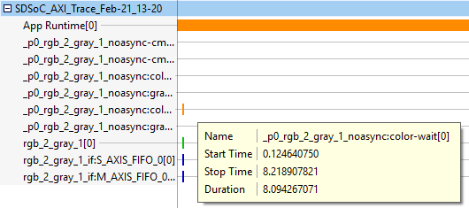
    

    

    <i>Detailed Information Available for Each Event</i>
    

5. Click on the previous/next event button () to see the start. Zoom out appropriately to see initial events.

    

    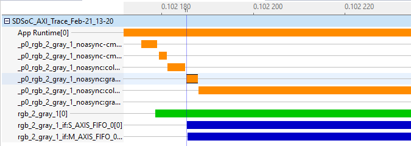
    

    

    <i>Various events which setup and start accelerator</i>
    

	Note the time axis is in seconds. The first orange event (software) is the command being sent to the accelerator. The green bar indicates the accelerator being used.

	The second event is the wait for the dma to respond. The third, fourth and the fifth (software) events deal with the dma associated with input and output.

	The first blue event (rgb_2_gray_1_if:S_AXIS_FIFO_0[0]) indicates the actual data being transferred whereas the second blue event is when the output (rgb_2_gray_1_if:M_AXIS_FIFO_0[0])) has started. The time difference between the start of the input and start of the output would be the latency.

6. Click somewhere on the second blue event and then click on the next event button. Zoom out to see the desired view.

    

    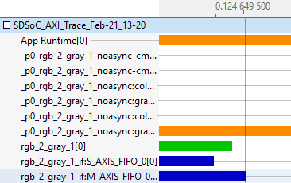
    

    

    <i>Tail end of the hardware accelerator events
</i>
    

	As can be seen, the blue input (rgb_2_gray_1_if:S_AXIS_FIFO_0[0])) finishes first.

	The second blue (rgb_2_gray_1_if:M_AXIS_FIFO_0[0])) finishes next just after the green accelerator.

7. Click on the \*:color-wait[0] orange bar and then click the next event button to see the tail end activities. Zoom as necessary.

    

    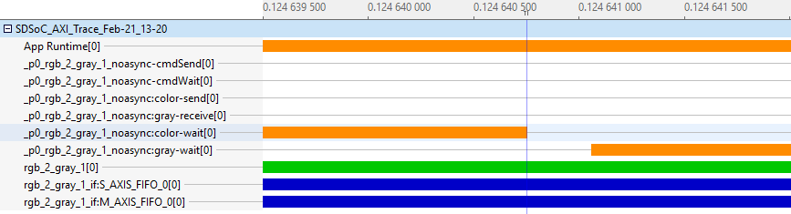
    

    

    <i>Tail end of the transaction</i>
    

	The orange output (_p0_rgb_2-gray_1_noasync:color-wait[0]) finishes followed by (_p0_rgb_2-gray_1_noasync:gray-wait[0]) indicating the completion of the execution.

### Analyze the built hardware using Vivado.
1. Start Vivado by selecting Start &gt; Xilinx Design Tools &gt; Vivado 2018.2
2. Click the Open Project link, open the design by browsing to {labs}\lab4b\Debug_sds\p0\vivado\prj and selecting prj.xpr
3. Click on Open Block Design in the Flow Navigator pane. The block design will open. Note various system blocks which connect to the Cortex-A9 processor (identified by ZYNQ in the diagram).

    

    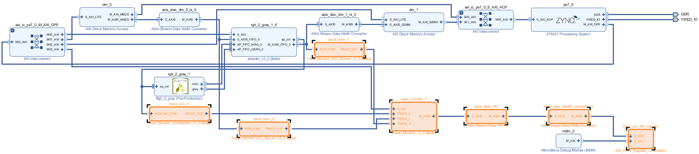
    

    

    <i>Block diagram with tracing hardware</i>
    

4. Close Vivado without saving the block diagram.
5. Close SDx by selecting **File \&gt; Exit**
6. Turn OFF the power to the board.

## Conclusion

In this lab, you performed speedup estimation of an application running under Standalone OS and Linux OS, after targeting desired function for acceleration. Performance estimation does not require the full bitstream generation and it gives speedup estimate by looking at the performance report generated by HLS for each function targeted in hardware. Event tracing provides insight into how various events are taking place and the relative time spent in data movement and data processing.