# Debugging Software Application

## Objectives

After completing this lab, you will be able to:

* Use the SDSoC environment to debug Standalone applications
* Use the SDSoC environment to debug Linux application

## Steps
## Create an SDx Project
### _Go through this step if you want to start from scratch otherwise skip to the next step._

### Launch SDx and create a project, called lab5, using Standalone OS and the Empty Application template targeting the PYNQ-Z1 or PYNQ-Z2 board. Then add the provided source files.
1. Open SDx, if not already open

	The Workspace Launcher window will appear.
2. Click on the Browse button and browse to { **labs},** if necessary, and click **OK**.
3. Select **File \&gt; New \&gt; SDx Project** to open the New Project GUI.
4. Enter **lab5** as the project name.
5. Click **Next** to see _Platform_ window showing various available platforms.
6. Select either _PYNQ-Z1[custom]_ or _PYNQ-Z2[custom]_ and click **Next.**

	Refer to Lab1 document to how to add custom platform if you don't see it listed .

7. Select _Standalone_ as the target OS and click **Next**.
8. Select **Empty Application** and click **Next**.
9. Click **Finish**.
### Import the provided source files from the {source}\lab5\src folder.
1. Right click on src under lab5 in the Project Explorer tab and select Import…
2. Click on File System under General category and then click Next.
3. Click on the Browse button, browse to the {source}\lab5\src folder, and click OK.
4. Either select all the files in the right-side window or select src checkbox in the left-side window and click Finish to import the files into the project.
### Mark sharpen_filter for the hardware acceleration. Setup for the Debug configuration.
1. Add sharpen_filter function for acceleration.
2. Right-click on lab5 and select Build Configurations &gt; Set Active &gt; Debug
3. Right-click on lab5 and select Build Project
The project will be built, generating the bitstream, and an SD card image. Since this will take about 40 minutes, we will import the pre-built project.

## Debugging Standalone Application 
Skip Step 2-1 if you are continuing from Step 1.

### Import the pre-built lab5 project which has sharpen_filter marked for the hardware acceleration. Uncheck the Generate SD card Image option.
1. Select File &gt; Import
2. Click on Existing Projects into Workspace under General and click **Next**.
3. Click on the Browse button of the Select archive file field, browse to {source}\lab5, select lab5.zip and click Open.

	Make sure that lab5 is checked in the Projects window.

4. Click **Finish**.
The project will be imported and lab5 folder will be created in the Project Explorer tab.

5. Expand the **lab5** folder and double-click on the _project.sdx_ entry.

	The project file will be opened and the sharpen_filter function entry will be displayed in the HW Functions window.

6.  **Uncheck** the _Generate SD Card Image_ option as it is already generated.
### Set the board to JTAG boot. Connect and power ON the board. Make terminal connection. Start the debug session. Step through 5 statements. Set a breakpoint on line 16 of the rgb_2_gray.c program.
1. Set the board to JTAG boot. Connect the board and power it ON.
2. Either use the SDx Terminal tab or use third party terminal emulator program like TeraTerm, Putty, HyperTerminal. Make a connection to an appropriate COM port, setting 115200 baud rate.
3. Right-click on the lab5 project in the Project Explorer tab, and select Debug As &gt; Launch on Hardware (SDx Application Debugger)

	The bitstream will be downloaded first to configure the board followed by the application download.

4. Click **Yes** to switch to the debug perspective, if asked.

	The debug perspective should show up.

	Note that the program counter is at the main function entry point- line 75. In the Debug view you will see the same information. The Variables tab shows various variables visible in the current scope, the type, and their content.

5. Click on the _Breakpoints_ tab and notice that two breakpoints are defined as default: (i) main and (ii) \_exit

    

    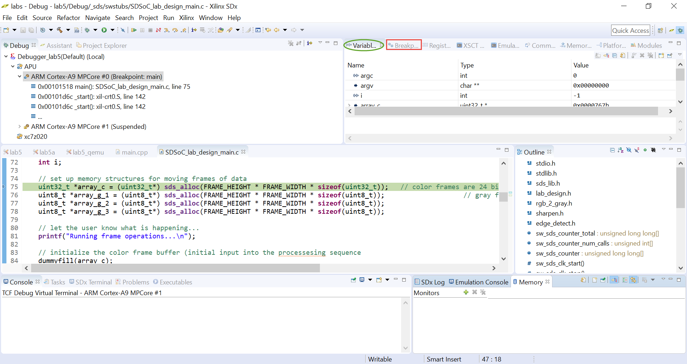
    

    

    <i>Debug perspective</i>
    

6. Click on the Step Over button about five times ( or press F6) to execute the printf statement (line 81).

	When the statement is executed, you will see a message is being printed in the Terminal tab.

7. Click on the SDx button on the top-right (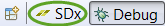) to change to the SDx C/C++ perspective.

	The Project Explorer will show up.

8. Expand **lab5 \&gt; src** and double-click on the _rgb\_2\_gray.c_ entry to open the file.
9. Double-click in the left border of the line (line 19) to set the breakpoint.

    

    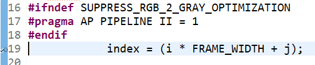
    

    

    <i>Set a breakpoint</i>
    

10. Switch back to the Debug perspective by clicking on the **Debug** button.
11. Click on the **Breakpoints** tab and notice that another entry is added.
### Continue with the execution. Inspect index variable. Observe memory content of gr variable changing.
1. Click on the Resume button () which will start executing until one of the breakpoints is encountered.

	Note that the program stops at line 19 of rgb_2_gray.

2. Click on the **Variables** tab and note the content of various variables. Select _index_ and note the value (0) and its address 0x41308f4.

    

    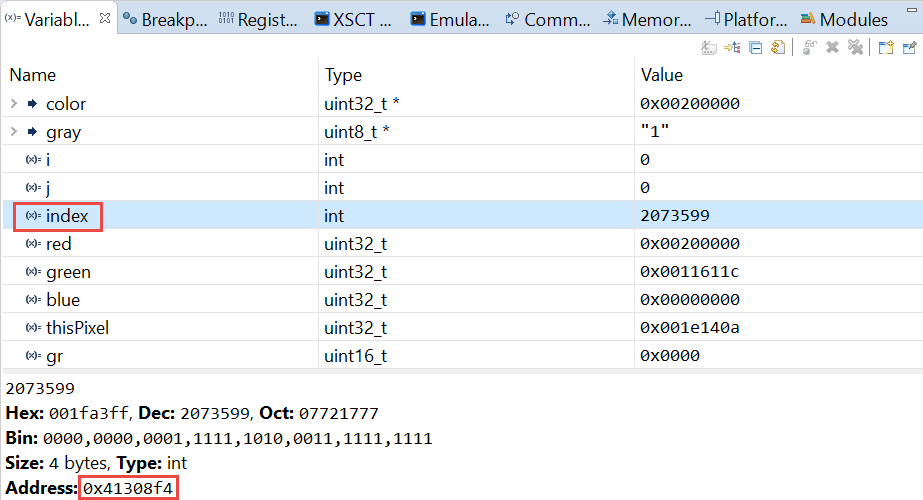
    

    

    <i>Variables content</i>
    

3. Click on the _Step Over_ button five times so that line 23 is highlighted. Note the variables content.

	The blue variable is highlighted as that was the last variable whose content changed while executing line 26 statement.

	Note the next statement which will be executed will compute the variable gr.

4. Select _gr_ and note the value (0) and the address 0x41308e2.
5. You can see its content in the Memory tab also. Select the Memory tab and click on &quot;+&quot; to open up the _Monitor Memory_ dialog box. Enter **0x41308e2** in the address bar and click **OK**.

    

    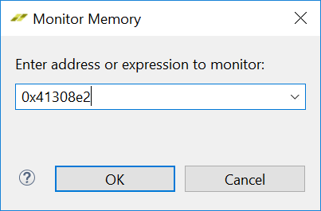
    

    

    <i>Monitor Memory window</i>
    

	The memory content will be displayed. The upper 16-bits represent the value.

6. Click on the _Step Over_ button one more time and notice that the new value was computed, and the memory content change is reflected. The variable tab&#39;s content also changed.

    

    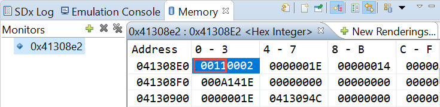
    

    

    <i>Variable gr's updated value in the Memory tab</i>
    

7. Move the mouse close to _gray_ array in line 28 and notice that it is a pointer to an array of type unit8\_t. The pointer is stored at 0x41308d8. The pointer value of which is _0x00C00000_.

    

    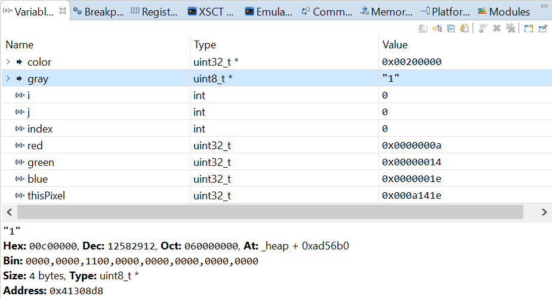
    

    

    <i>Array gray</i>
    

8. Scroll up the Memory tab 1 line to view the contents of location 0x41308d8 and notice that it is pointing to 0x00c00000.

    

    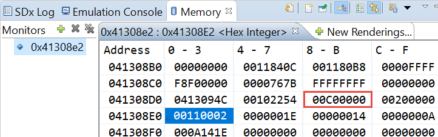
    

    

    <i>Pointer's content</i>
    

### Add 0x00C00000 (array_g_1 address) in the Memory tab, click the Resume button four times and observe the changing content. Remove the breakpoint set at line 19 and click the Step Return button to complete the function execution return to the main program.
1. Add 0x00C00000 in the Memory tab to view its content.
2. Click on Resume button four times and observe the array content changing.

    

    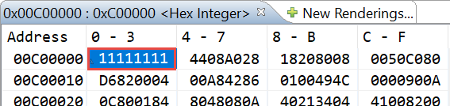
    

    

    <i>Array content changing</i>
    

3. Select the **Breakpoints** tab and uncheck the rgb\_2\_gray.c – line 19 check box. This will disable the breakpoint.
4. Click on the Step Return button () to execute the function and stop on line 100 of the SDSoC_lab_design_main.c program  (_p0_sharpen_filter_1_noasync).
5. Select the Variables tab and select array_g_1. Note its content and the address.

    

    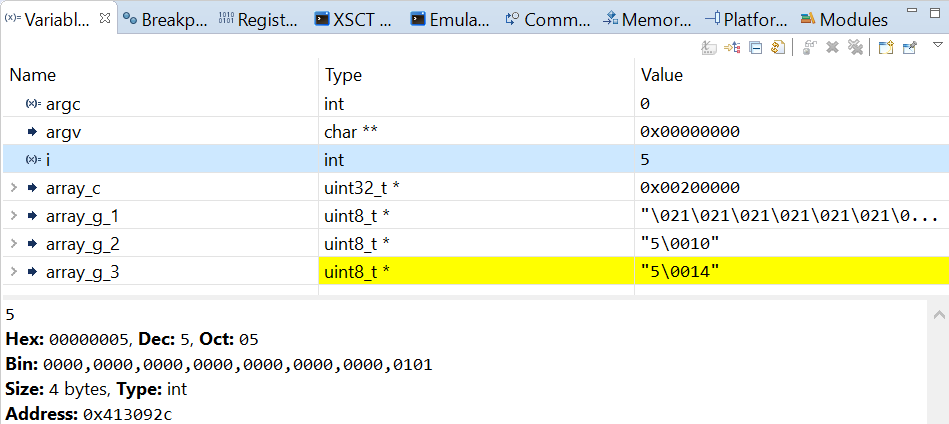
    

    

    <i>The processed content of array_g_1</i>
    

### Use Dump/Restore Data File feature of SDK to update the array_g_1's content with the provided binary data file stored in the source/lab5 directory.
### After the color buffer has been converted to gray, you will replace the content of array_g_1 with the binary data provided to you in the lab5_array_g_2.bin file.

1. Select **Xilinx \&gt; Dump/Restore Data File**
2. Click the _Select_ button, choose **Name=Xilinx Hardware Server** from the _Peers_ section.
3. Expand the **APU** entry in the _Contexts_ section and select **ARM Cortex-A9 MPCore #0**.
4. Click **OK**.
5. Click the **Browse** button, browse to {source}_\lab5\,_ choose **lab5\_array\_g\_1.bin**  **and c** lick **Save.**
6. Select the _Restore Memory_ option as we want to read the file contents into the memory.
7. Enter **0x00C00000** in the _Start Address_ field and **2073600** in the  **Size** field, where 2073600 is the number of pixels (1920 x 1080).

8. Click **OK**.

    

    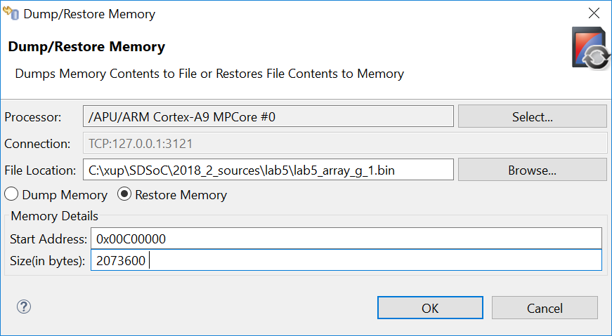
    

    

    <i>Updating memory content with a pre-created binary content</i>
    

	This will load the content into the array (you can see the progress in the SDK log window). You can see the updated content in the Memory tab.

	Note that the next statement which will be executed will be using the hardware accelerator (line 100).

9. Click the **Step Over** button.

	The array_g_2 content will be updated due to the execution of the statement.

10. Click the Disconnect () button to terminate the session.

## Debugging Linux Application 

### For this portion of the lab, you will need an Ethernet port on the PC configured to 192.168.0.1 as an IP address and an Ethernet cable connected between the PC and the board.

### You can execute Step 3-1 and Step 3-2 if you want to start from scratch otherwise skip to Step 3-3.

### Create a new empty application project called lab5a targeting Linux OS. Import the provided source files from source\lab5\src folder
1. Select File &gt; New &gt; Xilinx SDx Project to open the New Project GUI.
2. Enter lab5a as the project name, select either PYNQ-Z1[custom] or PYNQ-Z2[custom], select Linux as the target OS, select Empty Application and click Finish.
3. Right click on src under lab5a in the Project Explorer tab and select Import…
4. Click on File System under General category and then click Next.
5. Click on the Browse button, browse to {source}\lab5\src folder, and click OK.
6. Either select all the files in the right-side window or select src checkbox in the left-side window and click Finish to import the files into the project.
### Mark sharpen_filter for the hardware acceleration. Build the Debug project.
1. Add the sharpen_filter in HW Function pane.
2. Right-click on lab5a and select Build Configurations &gt; Set Active &gt; Debug
3. Right-click on lab5a and select Build Project
The project will be build, generating bit stream, and the SD card image.

	Since this will take about 35 minutes, we will import the pre-build project.

	If you are continuing from Step 3-2, then skip Step 3-3.

### Import the pre-built lab5a project which has sharpen_filter marked for the hardware acceleration. Uncheck the bitstream generation option.
1. Select File &gt; Import
2. Click on Existing Projects into Workspace under General and click Next.
3. Click on the Browse button of the Select archive file field, browse to {source}\lab5, select lab5a.zip and click Open.

	Make sure that lab5a is checked in the Projects window.

1. Click **Finish**.

	The project will be imported and lab5a folder will be created in the Project Explorer tab.

1. Expand the **lab5a** folder and double-click on the _project.sdx_ entry.

	The project file will be opened and the sharpen_filter function entry will be displayed in the HW Functions window.

1. **Uncheck** the _Generate SD Card Image_ option.
### Copy the sd_card content on the SD Card. Configure the board to boot from the SD card. Connect and power up the board. Setup the ip addresses both on the board and the PC Ethernet adaptor.
1. Using the Windows Explorer copy the content of the lab5a &gt; Debug &gt; sd_card onto the SD card. Place the SD card into the board.
2. Configure the board to boot from the SD card.
3. Connect the board, including network cable, and power it ON.

	The board will boot.

1. Make the serial connection using the appropriate COM port.
2. Press the _PS-SRST_ button on the board to reboot and notice Linux booting.
3. Once the board boot is complete, set the ip address of the board to 192.168.0.10 typing the following command at the Linux prompt:
ifconfig and note if any address is being assigned. If not assigned then execute the following command to assign to the correct Ethernet adaptor.

    

    
    

    

    <i>Assigning an IP address</i>
    

1. Using the control panel on the PC, configure the PC Ethernet adaptor with the static IP address to 192.168.0.1.

	You can verify the connectivity by using ping 192.168.0.1 command from the board's prompt.

### Make target connection and start debugging the application.
1. In the Target Connections tab, expand Linux TCF Agent and double-click on Linux Agent [default]

    

    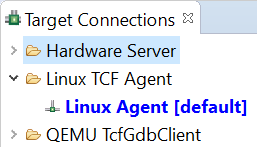
    

    

    <i>Accessing Linux Agent</i>
    

	Alternately, in the Actions panel, for the connection, click on the New button.

1. Enter **192.168.0.10** in the _Host_ field and then click **OK** making sure that the Port field is set to **1534**.

    

    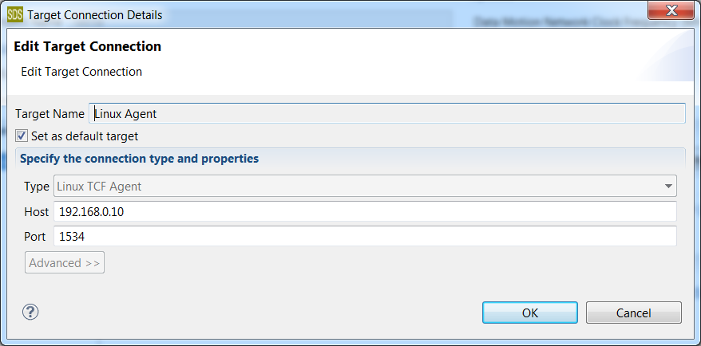
    

    

    <i>Making connection for Linux target</i>
    

1. Right-click on _lab5a_ project in the _Project Explorer_ and select **Debug As \&gt; Launch on Hardware (SDx Application Debugger)**.

	The connection will be made.

	The debug perspective should show up. If it doesn't then click on the Debug perspective button.

	Note that the program counter is at the main function - line 75. The Variables tab shows various variables visible in the current scope, the type, and their content.

1. Click on the **Step Over** button five times to execute the _printf_ statement. When executed, you will see the message in the **Console** tab.
T
	he variables tab will show various variables and arrays. Note that the value may be same as in the Standalone application but the addresses where they are defined will be different as the application is running under Linux.

1. Click on the SDx button on the top-right to change to the _SDx C/C++_ perspective.

	The Project Explorer will show up.

1. Expand **lab5a \&gt; src** and double-click on the _rgb\_2\_gray.c_ entry to open the file.
2. Double-click in the left border of the line 19 to set the breakpoint.
3. Switch back to the _Debug_ perspective by clicking on the **Debug** button.
4. Click on the **Resume** button which will start executing until one of the breakpoints is encountered.
5. Note that the program stops at line 19 of _rgb\_2\_gray_.
6. Click Step Over button to execute the statement.
7. Select _index_ and note the value (0) and its address 0xbeb3fc6c. Note the address may be different as MMU is used to translate virtual address into a physical address.
8. Click on the _Step Over_ button four times such that line 26 is highlighted. Note the variables content.

	Note the next statement which will be executed will compute the variable gr.

1. Click Step Over button to execute the statement.
2. Select _gr_ and note the value (0x0011) and the address 0xbeb3fc5a. Note the address may be different as MMU is used to translate virtual address into a physical address.
3. You can see its content in the Memory tab also. Select the Memory tab and click on &quot;+&quot; to open the _Monitor Memory_ dialog box. Enter the address and click **OK**.

	The memory content will be displayed. The upper 16-bits represent the value.

	Since MMU is used in Linux, you won't be able to see the content of the arrays and you won't be able to use the Dump/Restore Data File feature of SDx.

1. Remove the breakpoint and click Resume to execute the program to the completion.

	This may take about 30 seconds.

1. Click on the Terminate button followed by click on the Disconnect button.
2. Turn OFF the board and close the SDx IDE.

## Conclusion

In this lab, you debugged Standalone and Linux applications using SDx software debugger. The Standalone application was debugged using JTAG connection whereas the Linux application was debugged over Ethernet. In Standalone application you were able to look into various arrays using the addresses and able to use the Dump/Restore Data File feature of SDSoC. In Linux application this was not possible as MMU translates the virtual addresses of arrays and pointers into physical addresses. 