# Fine-Tuning with Vivado HLS

## Objectives

After completing this lab, you will be able to:

* Improve performance using the PIPELINE directive
* Understand the DATAFLOW directive functionality
* Apply memory partitioning techniques to improve data access

## Steps
## Create an SDx Project 
### Launch SDx and create a project, called lab6, using the Empty Application template and then using the provided source files, targeting the PYNQ-Z1 or PYNQ-Z2 board and Standalone OS.
1. Open SDx, select {labs} as the workspace and click OK.
2. Create a new project called lab6 targeting either PYNQ-Z1[custom] or PYNQ-Z2[custom] board and Standalone OS, Empty Application template.
Refer to Lab1 document to how to add custom platform if you don't see it listed.

### Import the provided source files from source\lab6\src folder.
1. Right click on src under lab6 in the Project Explorer tab and select Import…
2. Click on File System under General category and then click Next.
3. Click on the Browse button, browse to {source}\lab6\src folder, and click OK.
4. Either select all the files in the right-side window or select src checkbox in the left-side window and click Finish to import the files into the project.

## Performance Estimation
### Mark dct for the hardware acceleration operating at 100 MHz. Run an initial performance estimate of the hardware only.
1. Add the dct function operating at 100 MHz in the HW Function pane.
2. In the Options panel of the SDx Project Overview, click on the Estimate Performance
3. Set the build configuration to Debug and then build the project.
4. After the build is over, you can see an initial report. This report contains a hardware-only estimate summary and has a link that can be clicked to obtain the software run data, which updates the report with comparison of hardware implementation versus the software-only information.
Note that the hardware accelerator performs the function in approximately 33011 clock cycles (estimated) clock cycles.

    

    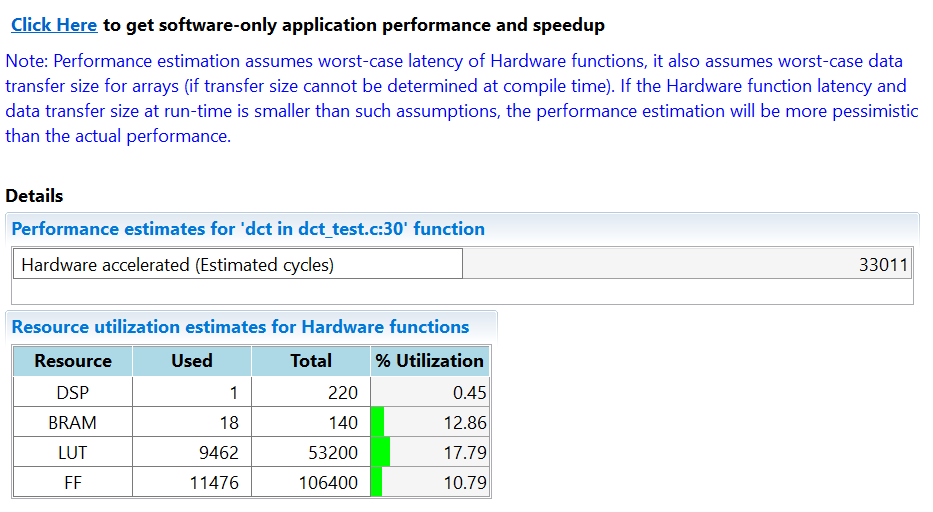
    

    

    <i>Initial estimate of hardware only performance</i>
    

## Synthesize the Design Using Vivado HLS
### Analyze the source (dct.c) code.
1. Double-click on the dct.c under the source folder to open its content in the information pane.

    

    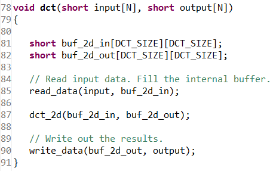
    

    

    <i>The design under consideration</i>
    

	The top-level function dct, is defined at line 78. It implements a 2D DCT algorithm by first processing each row of the input array via a 1D DCT then processing the columns of the resulting array through the same 1D DCT. It calls read_data, dct_2d, and write_data functions.

	The read_data function is defined at line 54 and consists of two loops – RD_Loop_Row and RD_Loop_Col. The write_data function is defined at line 66 and consists of two loops which write the result. The dct_2d function, defined at line 23, calls dct_1d function and performs a transpose.

	Finally, the dct_1d function, defined at line 4, uses dct_coeff_table and implements a basic iterative form of the 1D Type-II DCT algorithm. The following figure shows the function hierarchy on the left-hand side, and the loops in the order they are executed, and the flow of data, on the right-hand side.

    

    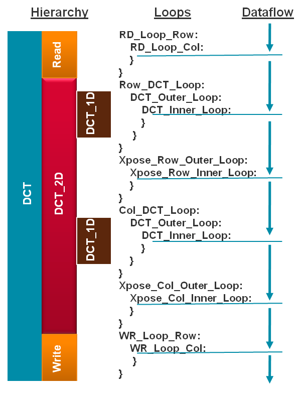
    

    

    <i>Design hierarchy and dataflow</i>
    

### Invoke Vivado HLS. Synthesize the design with the defaults. View the synthesis results.
1. In the lab6 SDx Project Settings pane, click on () to invoke the Vivado HLS program.

	The HLS launcher dialog box will appear.

1. Click **OK**.
2. In Vivado HLS, select Solution &gt; Run C Synthesis &gt; Active Solution or click on the () button to start the synthesis process.

	This is just to view the log file.

1. When synthesis is complete, the results will be displayed in the **Synthesis(Solution)** tab.

    

    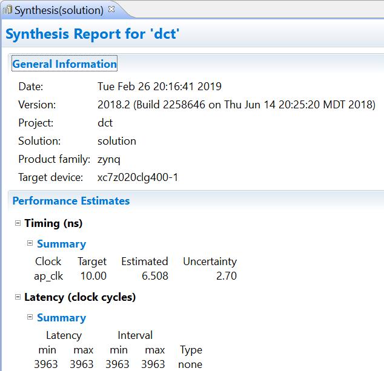
    

    

    <i>Synthesis report showing performance estimate</i>
    

	Notice that the estimated period is 6.508 ns. The latency and the interval are 3963 clocks. The Type is none since no pipeline was implemented.

1. Expand the **Source** folder and double-click on the _dct.c_ to view the source file.

    

    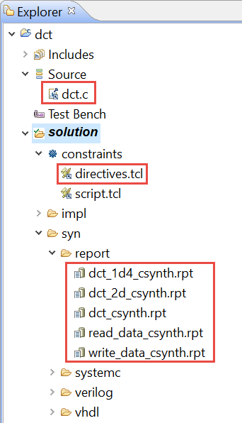
    

    

    <i>Project Explorer view</i>
    

	Note that the Synthesis Report section in the Explorer view shows dct_1d.rpt, dct_2d.rpt, dct_csynth.rpt, read_data, and write_data entries.

1. Double-click on the **directives.tcl** entry and examine its content.
Notice that input and output ports are using single-port block RAM (RAM_1P), and the desired latency is 1. You can verify this by selecting the dct.c tab and looking at the Directive tab. Also notice the "%" for the directives which indicate that they are passed via the directives.tcl file. Pragmas in the source code are indicated with a "#".

    

    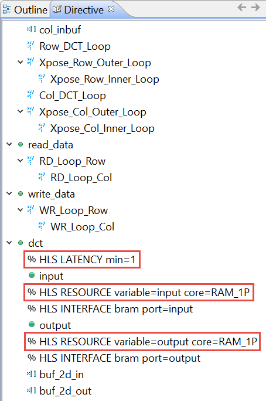
    

    

    <i>The Directive tab showing the directives passed from SDSoC</i>
    

1. Select the _Synthesis(solution)_ tab and then click on the **Interface** entry under the _Outline_ tab.

	The interface summary table will be displayed. It shows the six handshaking signals (ap_clk, …, ap_ready) and then shows the single port bram ports for the input and output parameters.

    

    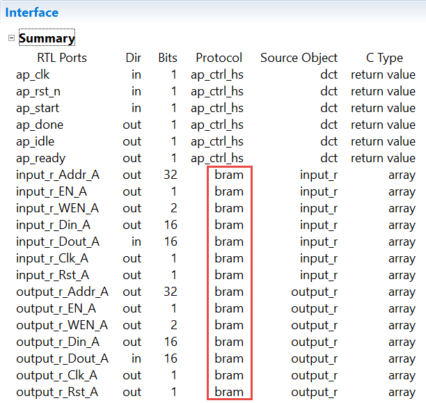
    

    

    <i>Interface summary showing single port bram interface for the input and output</i>
    

1. Scroll through the Console tab to see the synthesis process log.

### Create a new solution (solution1) copying the directives from the existing solution (solution). Remove the HLS INTERFACE directive on the input port Synthesize the design again. View the synthesis results.
1. Select Project &gt; New Solution.
2. A Solution Configuration dialog box will appear. Click the **Finish** button (with copy from Solution selected).
3. With the source code file in focus, in the directives tab, under dct, right-click on the HLS INTERFACE directive of the input port, select Remove Directive.

    

    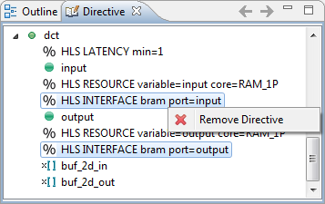
    

    

    <i>Remove HLS Interface directive</i>
    

1. Similarly, remove the HLS INTERFACE directive of the _output_ port.
2. Click on the synthesis button to start the synthesis process.
3. When synthesis is completed, the results will be displayed in the Synthesis(Solution1) tab.

	Notice that the performance estimations have changed slightly.

	Note that the Synthesis Report section (under Solution1) in the Explorer view now only shows dct_1d.rpt, dct_2d.rpt, and dct.rpt entries. The read_data and write_data functions reports are not listed. This is because these two functions are inlined. Verify this by scrolling up into the Vivado HLS Console view.

    

    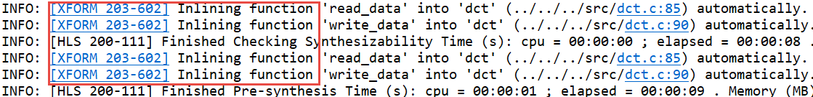
    

    

    <i>Inlining of read_data and write_data functions</i>
    

1. The report also shows the top-level interface signals generated by the tools.

    

    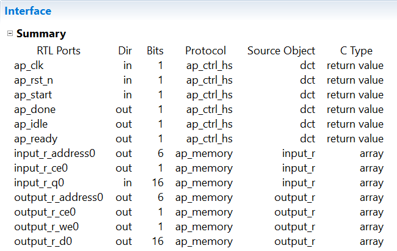
    

    

    <i>Generated interface signals</i>
    

	The top-level function has input and output arrays without the HLS interface of bram directive. An ap_memory interface is generated for each of them instead.

1. Open dct\_1d2.rpt and dct\_2d.rpt files either using the Explorer view or by using a hyperlink at the bottom of the dct.rpt in the information view. The report for dct\_2d clearly indicates that most of this design cycles (3668) are spent doing the row and column DCTs.  Also the dct\_1d2 report indicates that the latency is 209 clock cycles ((24+2)\*8+1) for ZedBoard.

## Apply PIPELINE Directive
### Create a new solution by copying the previous solution settings. Apply the PIPELINE directive to DCT_Inner_Loop, Xpose_Row_Inner_Loop, Xpose_Col_Inner_Loop, RD_Loop_Col, and WR_Loop_Col. Generate the solution and analyze the output.
1. Select Project &gt; New Solution or click on () from the tools bar buttons.
2. A Solution Configuration dialog box will appear. Click the Finish button (with copy from Solution1 selected).
3. Make sure that the dct.c source is opened in the information pane and click on the Directive tab.
4. Select DCT_Inner_Loop of the dct_1d function in the Directive pane, right-click on it and select Insert Directive...
5. A pop-up menu shows up listing various directives. Select the PIPELINE directive.
6. Leave II (Initiation Interval) blank as Vivado HLS will attempt to schedule the design with II = 1; one new input every clock cycle.
7. Click OK.
8. Similarly, apply the PIPELINE directive to Xpose_Row_Inner_Loop and Xpose_Col_Inner_Loop of the dct_2d function, and RD_Loop_Col of the read_data function, and WR_Loop_Col of the write_data function. At this point, the Directive tab should look like as follows.

    

    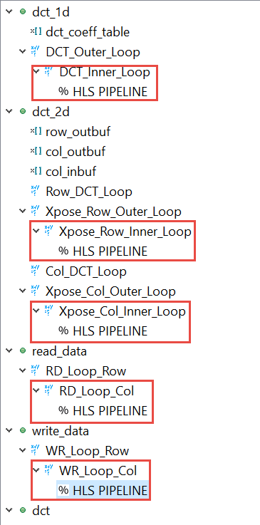
    

    

    <i>PIPELINE directive applied</i>
    

1. Click on the **Synthesis** button.
2. When the synthesis is completed, select Project &gt; Compare Reports… or click on the () button to compare the two solutions.
3. Select Solution1 and Solution2 from the Available Reports, click on the Add&gt;&gt; button, and then click OK.
4. Observe that the latency has reduced from 3959 to 1854 clock cycles.

    

    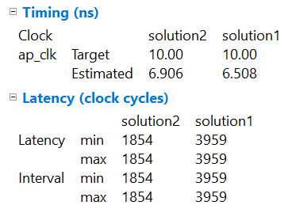
    

    

    <i>Performance comparison after pipelining</i>
    

1. Scroll down in the comparison report to view the resources utilization.  Observe that the LUTs utilization increased whereas BRAM and DSP48E remained same.

    

    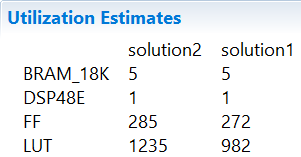
    

    

    <i>Resources utilization after pipelining</i>
    

### Open the Analysis perspective and determine where most of the clock cycles are spent, i.e. where are the large latencies.
1. Click on the Analysis perspective button ().
2. In the Module Hierarchy, select the dct entry and observe the RD_Loop_Row_RD_Loop_Col and WR_Loop_Row_WR_Loop_Col entries. These are two nested loops, flattened, and given the new names. The new names are formed by appending the inner loop name to the outer loop name. You can also verify this by looking in the Console view message. Notice that the DCT_Outer_Loop could not be flattened.

    

    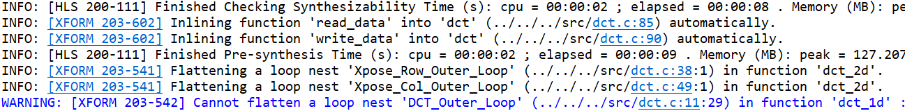
    

    

    <i>The console view content indicating loops flattening</i>
    

    

    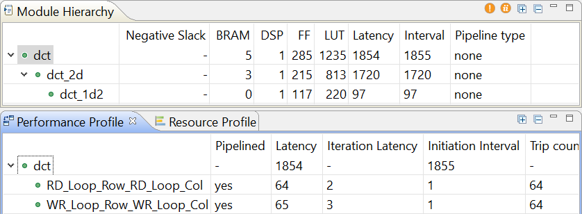
    

    

    <i>The performance profile at the dct function level</i>
    

1. In the _Module Hierarchy_ tab, expand the **dct** hierarchy completely.  Notice that the most of the latency occurs is in dct\_2d function. Select the _dct\_1d2_ entry.
2. In the _Performance Profile_ tab, select the _DCT\_Inner\_Loop_ entry
3. In the Performance view, right-click on the node\_60 (write) block in the C3 state, and select Goto Source. Notice that line 19 is highlighted which is preventing the flattening of the DCT\_Outer\_Loop.

    

    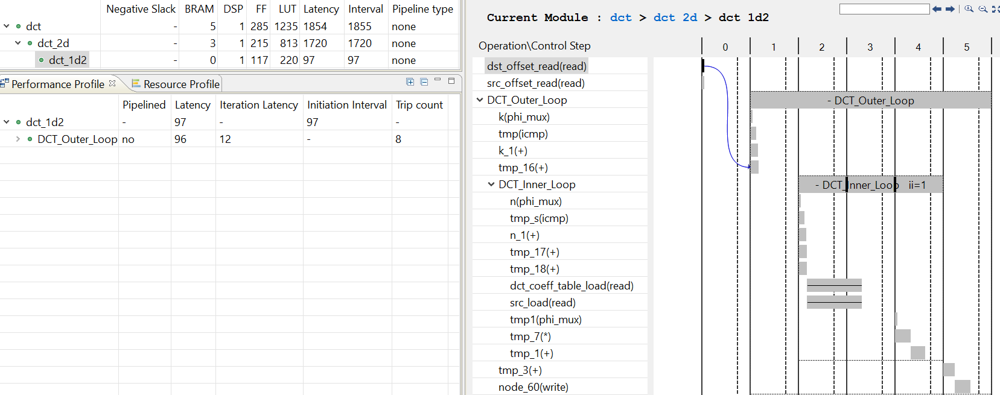
    

    

    <i>Understanding what is preventing DCT_Outer_Loop flattening</i>
    

1. Switch to the _Synthesis_ perspective.
### Create a new solution by copying the previous solution settings. Apply fine-grain parallelism of performing multiply and add operations of the inner loop of dct_1d using PIPELINE directive by moving the PIPELINE directive from inner loop to the outer loop of dct_1d. Generate the solution and analyze the output.
1. Select Project &gt; New Solution.
2. A Solution Configuration dialog box will appear. Click the Finish button (with Solution2 selected).
3. Close all inactive solution windows by selecting Project &gt; Close Inactive Solution** Tabs.**
4. With the source code open, in the Directive pane, select the PIPELINE directive of the DCT_Inner_Loop of the dct_1d function, right-click on it and select Remove Directive.
5. In the Directive pane again, select the DCT_Outer_Loop of the dct_1d function, right-click on it and select Insert Directive...
6. A pop-up menu shows up listing various directives. Select the PIPELINE directive
7. Click Yes and then OK.

    

    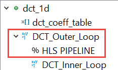
    

    

    <i>PIPELINE directive applied to DCT_Outer_Loop</i>
    

	By pipelining an outer loop, all inner loops will be unrolled automatically (if legal), so there is no need to explicitly apply an UNROLL directive to DCT_Inner_Loop. Simply move the pipeline to the outer loop: the nested loop will still be pipelined but the operations in the inner-loop body will operate concurrently.

1. Click on the **Synthesis** button.
2. When the synthesis is completed, select **Project \&gt; Compare Reports…** to compare the two solutions.
3. Select _Solution2_ and _Solution3_ from the **Available Reports,** click on the **Add\&gt;\&gt;** button, and then click **OK**.
4. Observe that the latency reduced from 1854 to 894.

    

    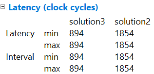
    

    

    <i>Performance comparison after pipelining</i>
    

1. Scroll down in the comparison report to view the resources utilization.  Observe that the utilization of all resources (except BRAM) increased.  Since the **DCT\_Inner\_Loop** was unrolled, the parallel computation requires 8 DSP48E.

    

    
    

    

    <i>Resources utilization after pipelining</i>
    

1. Open the dct\_1d2 report and observe that the pipeline initiation interval (II) is four (4) cycles, not one (1) as might be hoped, and there are now 8 BRAMs being used for the coefficient table.
Looking closely at the synthesis log, notice that the coefficient table was automatically partitioned, resulting in 8 separate ROMs: this helped reduce the latency by keeping the unrolled computation loop fed, however the input arrays to the dct_1d function were not automatically partitioned.

    

    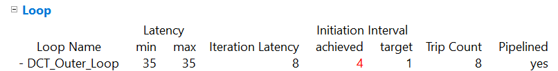
    

    

    <i>Increased resource utilization of dct_1d</i>
    

    

    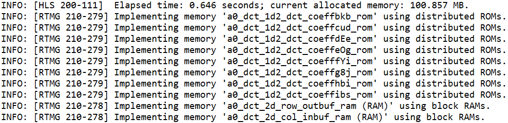
    

    

    <i>Automatic partitioning of dct_coeff_table</i>
    

    

    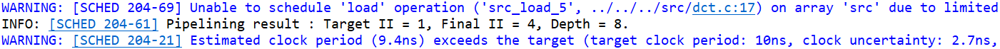
    

    

    <i>Initiation interval of 4</i>
    

### Perform design analysis by switching to the Analysis perspective and looking at the dct_1d performance view.
1. Switch to the Analysis perspective, expand the Module Hierarchy entries, and select the dct_1d entry.
2. Expand, if necessary, the Performance Profile tab entries and notice that the DCT_Outer_Loop is now pipelined and there is no DCT_Inner_Loop entry.

    

    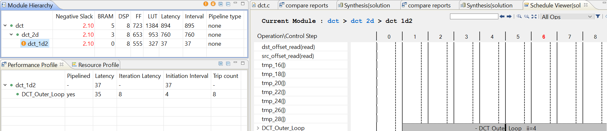
    

    

    <i>DCT_Outer_Loop flattening</i>
    

1. Switch to the _Synthesis_ perspective.

## Improve Memory Bandwidth
### Create a new solution by copying the previous solution (Solution3) settings. Apply ARRAY_PARTITION directive to buf_2d_in of dct (since the bottleneck was on src port of the dct_1d function, which was passed via in_block of the dct_2d function, which in turn was passed via buf_2d_in of the dct function) and col_inbuf of dct_2d. Generate the solution.
1. Select Project &gt; New Solution to create a new solution.
2. A Solution Configuration dialog box will appear. Click the Finish button (with Solution3 selected).
3. With dct.c open, select buf_2d_in array of the dct function in the Directive pane, right-click on it and select Insert Directive...

	The buf_2d_in array is selected since the bottleneck was on the src port of the dct_1d function. This array was passed via in_block of the dct_2d function, which in turn was passed via buf_2d_in of the dct function).

1. A pop-up menu shows up listing various directives.  Select the **ARRAY\_PARTITION** directive.
2. Make sure that the **type** is _complete_.  Enter **2** in the _dimension_ field and click **OK**.

    

    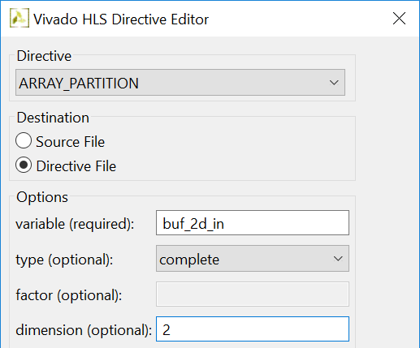
    

    

    <i>Applying ARRAY_PARTITION directive to memory buffer</i>
    

1. Similarly, apply the _ARRAY\_PARTITION_ directive with dimension of _2_ to the **col\_inbuf** array of the dct\_2d function.
2. Click on the **Synthesis** button.
3. When the synthesis is completed, select **Project \&gt; Compare Reports…** to compare the two solutions.
4. Select _Solution3_ and _Solution4_ from the **Available Reports,** and click on the **Add\&gt;\&gt;** button.
5. Observe that the latency reduced from 894 to 528.

    

    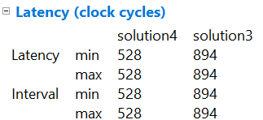
    

    

    <i>Performance comparison after array partitioning</i>
    

1. Scroll down in the comparison report to view the resources utilization.  Observe the increase in the FF resource utilization (almost double) and BRAM\_18K utilization reduced as the two selected arrays were completely partitioned.

    

    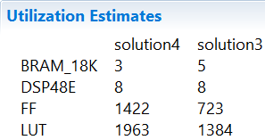
    

    

    <i>Resources utilization after array partitioning</i>
    

1. Expand the **Loop** entry in the **dct.rpt** entry and observe that the Pipeline II is now _1_.

    

    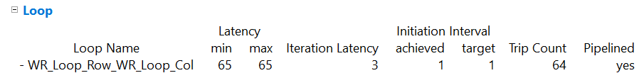
    

    

    <i>II=1 achieved</i>
    

## Apply DATAFLOW Directive
### Create a new solution by copying the previous solution (Solution4) settings. Apply the DATAFLOW directive to improve the throughput. Generate the solution and analyze the output.
1. Select Project &gt; New Solution.
2. A Solution Configuration dialog box will appear. Click the Finish button (with Solution4 selected).
3. Close all inactive solution windows by selecting Project &gt; Close Inactive Solution** Tabs.**
4. Select function dct in the directives pane, right-click on it and select Insert Directive...
5. Select the DATAFLOW directive to improve the throughput.
6. Click on the Synthesis button.
7. When the synthesis is completed, the synthesis report is automatically opened.
8. Observe that dataflow type pipeline throughput is listed in the Performance Estimates.

    

    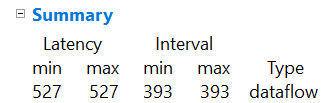
    

    

    <i>Performance estimate after DATAFLOW directive applied</i>
    

	The Dataflow pipeline throughput indicates the number of clock cycles between each set of inputs reads (interval parameter). If this value is less than the design latency it indicates the design can start processing new inputs before the currents input data are output.

	Note that the dataflow is only supported for the functions and loops at the top-level, not those which are down through the design hierarchy. Only loops and functions exposed at the top-level of the design will get benefit from dataflow optimization.
1. Look at the console view and notice that dct\_coeff\_table is automatically partitioned in dimension 2. The buf\_2d\_in and col\_inbuf arrays are partitioned as we had applied the directive in the previous run.  The dataflow is applied at the top-level which created channels between top-level functions read\_data, dct\_2d, and write\_data.

    

    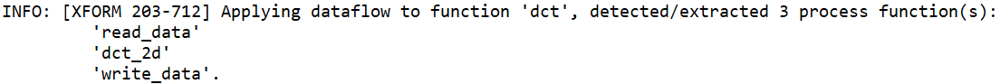
    

    

    <i>Console view of synthesis process after DATAFLOW directive applied</i>
    

### Save the directives as pragmas in the dct.c file and exit Vivado HLS.
1. Double-click on the directives.tcl entry under solutions5 &gt; constraints.

    

    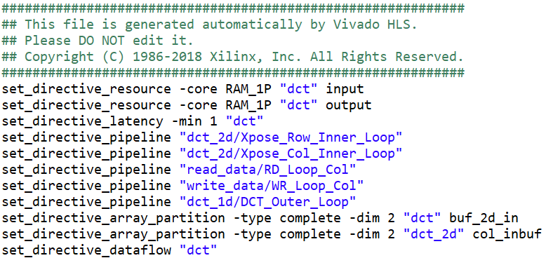
    

    

    <i>The applied directives</i>
    

1. Since SDx does not use the _directives.tcl_ file, we will need to move all the desired directives and implement them as _pragmas_ in the _dct.c_ source file.
2. With _dct.c_ open and in focus, in the **Directives** tab, select one directive at a time, right-click on it, select and **Modify Directive**.
3. Select **Source file** as the _destination_ and click **OK**.

    

    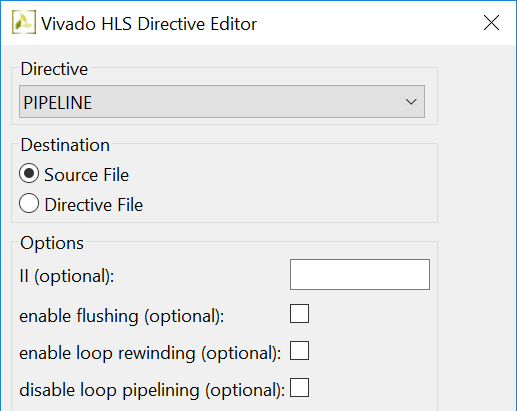
    

    

    <i>Move directives to source file</i>
    

	When all eleven directives are transferred to the source file, you should see #pragma directives on lines 14, 29, 43, 56, 69, 83, 90, 91, 92, 93, and 96.

1. Select **File \&gt; Save**.
2. Close Vivado HLS by selecting **File \&gt; Exit.**

## Performance Estimation of Optimized Model
### Clean the project and re-estimate the performance.
1. Right-click the top-level folder for the project and click on Clean Project in the menu.
2. Build the project.
3. After the build is over, you can see an initial report. This report contains a hardware-only estimate summary.

    

    
    

    

    <i>Initial estimate of hardware only performance of the optimized code</i>
    

	The Summary section shows that the estimated HW acceleration is 10677 compared to the initial hardware acceleration of 33011, yielding a 3.1x improvement.

## Conclusion

In this lab, you learned various techniques to improve the performance using Vivado HLS. These directives can be used with SDSoc through pragma statements. The PIPELINE directive when applied to outer loop will automatically cause the inner loop to unroll. When a loop is unrolled, resources utilization increases as operations are done concurrently. Partitioning memory may improve performance but will increase BRAM utilization. When the DATAFLOW directive is applied, the default memory buffers (of ping-pong type) are automatically inserted between the top-level functions and loops. The Analysis perspective and console logs can provide insight on what is going on.