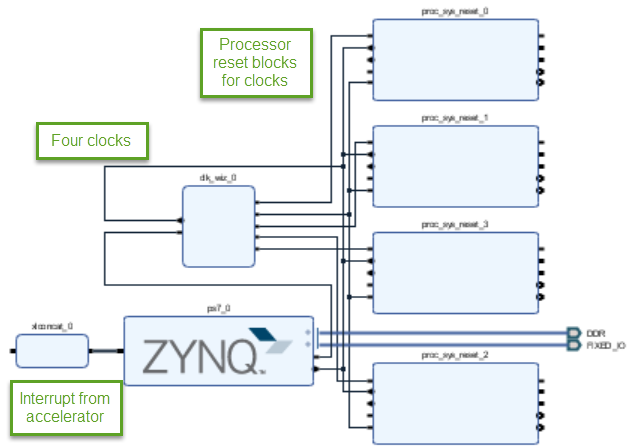
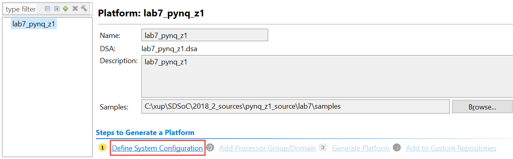
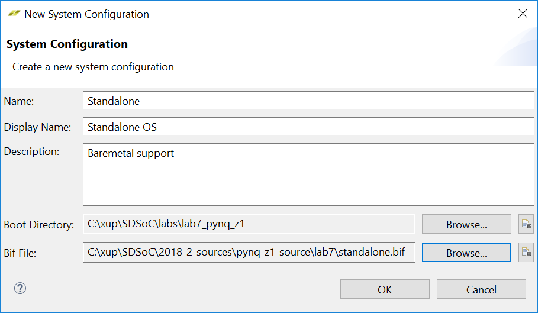
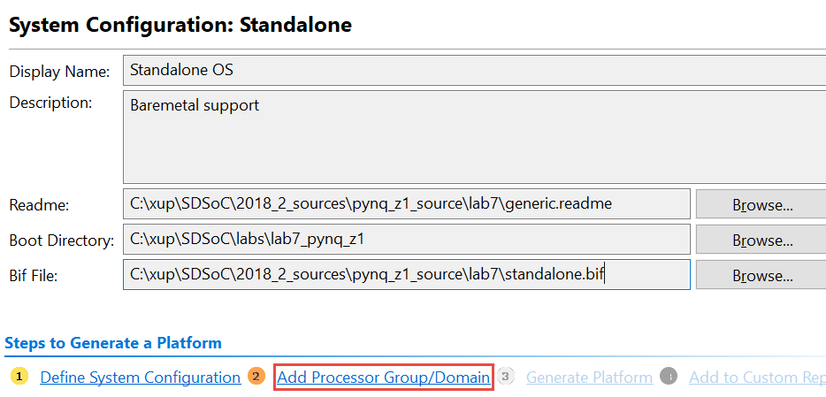
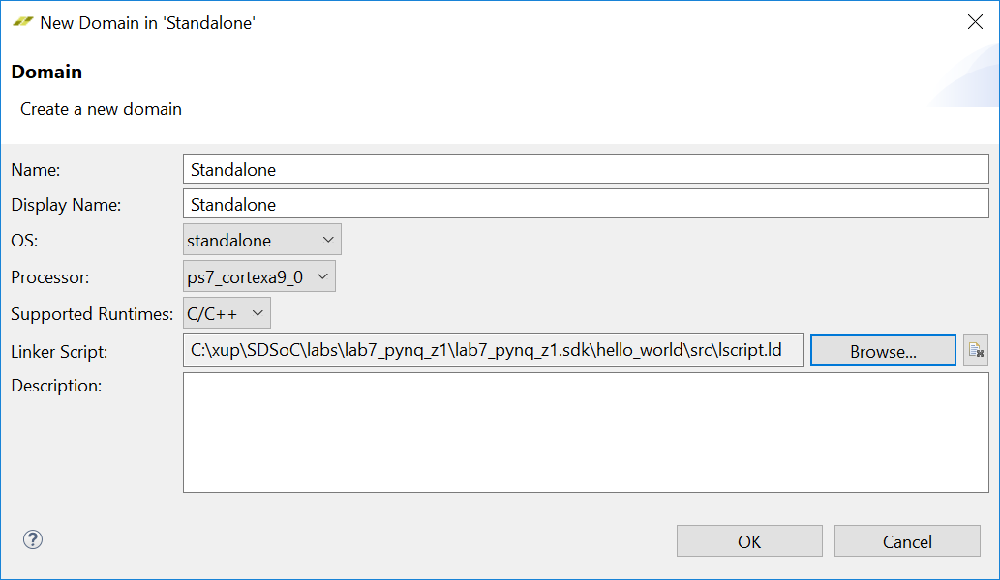
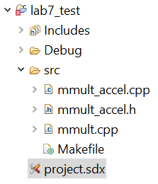
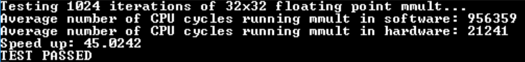
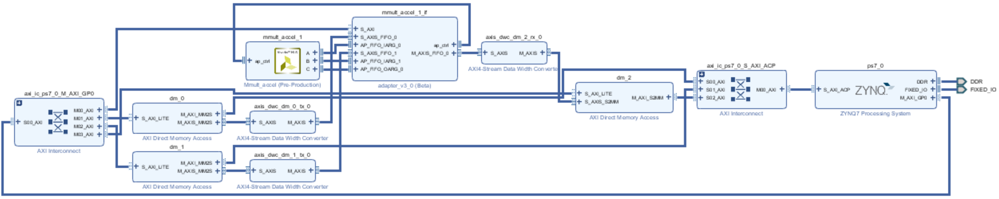

# Creating and Using Platform for an Application

## Objectives

After completing this lab, you will be able to:

* Create an SDx platform for a custom application
* Use the SDx environment to test the created custom platform

## Steps
## Create a Custom Platform

### Launch Vivado, create the platform design, generate the output products and export the hardware.
1. Open Vivado by selecting **Start &gt; Xilinx Design Tools &gt; Vivado 2018.2**
2. In the Vivado's Tcl Console window change the directory to the **{labs}/** using the _cd_ command.
3. Execute the following command to generate the platform hardware.

	source ../2018\_2\_sources/&lt;pynq\_z1 | pynq\_z2&gt;\_source/lab7/lab7\_&lt; pynq\_z1 | pynq\_z2&gt;.tcl

	This will create an IPI design, create an HDL wrapper, and add it to the design.

    

    
    

    

    <i>The IPI design</i>
    

4. Expand the **lab7\_pynq\_&lt;z1 | z2&gt;\_ wrapper**, right-click on the **lab7\_pynq\_&lt;z1 | z2&gt;\_ i** block and select **Generate Output Products**.
5. Click **Generate**.

	Wait for approximately 7-8 minutes for the output products to be generated. You can see the status in the Design Runs tab.

6. Once the output products are generated, click **File** &gt; **Export** &gt; **Export Hardware** to export the hardware. Make sure **Include Bitstream** is _unchecked_.

	The lab7\_pynq_&lt;z1 | z2&gt;.sdk directory will be created under the project directory.

7. Execute the following command to create the project dsa file in the {labs} directory which will be used in creating the custom platform.

	source ../2018\_2\_sources/&lt;pynq\_z1 | pynq\_z2&gt;\_source/lab7/build\_lab7\_pynq\_&lt;z1 | z2&gt;\_dsa.tcl

### Build the software template
1. Invoke XSDK by selecting **File &gt; Launch SDK**.
2. Select **File&gt; New &gt; Application Project**.
3. Enter **fsbl** in the _Project name_ field.
4. For the Board Support Package, select **Create New** and click **Next**.
5. Select **Zynq FSBL** from the _Available Templates_ pane and click **Finish**.
6. Right-click on the _fsbl_ entry and select **build project**.

	The fsbl.elf file is required to create a bootable SD image.

### Create a BOOT image
1. Select **Xilinx &gt; Create Boot Image**.
2. Browse to **lab7\_&lt;pynq\_z1 | pynq\_z2&gt;.sdk** directory for the _Output BIF File_ path.
3. Click **Create Image** to create the image file (BOOT.bin) in the _*.sdk\fsbl\bootimage_ directory.

	The fsbl application does not include DDR as one of the target memories. The actual application typically does target DDR memory. Though your application may not be using alloc/calloc/malloc calls, which uses heap memory, the relatively larger memory is required for holding scheduling information and for event tracking structures during the booting up process.

### Generate a dummy custom hello_world application, generate its linker script with heap size changed to 64 MB. Make sure that DDR memory is selected for the stack/heap.
1. Select **File&gt; New &gt; Application Project**.
2. Enter **hello_world** in the _Project name_ field.
3. For the Board Support Package, select **fsbl_bsp** in the _Use existing_ option, and click **Next**.
4. Select **Hello World** from the _Available Templates_ pane and click **Finish**.
5. Right-click on the **hello_world** application and select **Generate linker script**.
6. Change the heap size to **64 MB (67108864)**, stack size to **256 KB ( 262144 )**, making sure that _ps7\_ddr\_0_ is the target memory for the Heap and Stack.
7. Click **Generate** to generate the script. Click **Yes** to overwrite.

	There is no need to build this project as we really need the lscript.ld file.

8. Close XSDK and Vivado by selecting **File &gt; Exit** in their respective windows.
9. Using the Windows Explorer, copy _BOOT.bin_ from **{labs}\lab7\_pynq\_&lt;z1 | z2&gt;\lab7\_pynq\_&lt;z1 | z2&gt;.sdk\fsbl\bootimage**, and _fsbl.bin_ from **{labs}\lab7\_pynq\_&lt;z1 | z2&gt;\lab7\_pynq\_&lt;z1 | z2&gt;.sdk\fsbl\Debug** into **{labs}\lab7\_pynq\_&lt;z1 | z2&gt;.**

## Invoke SDx and Generate the Custom Platform
### Generate the custom platform targeting standalone OS using the Platform Generator wizard and generated hardware (.dsa), BOOT.bin, fsbl.elf files.
1. Using the Windows Explorer, create an empty directory **lab7\_platform** under **{labs}\labs**.
2. Select **Start &gt; Xilinx Design Tools &gt; SDx 2018.2**
3. Select **{labs}\lab7\_platform** as the workspace.
4. Click on the **Create SDx Project** link in the _Welcome_ window or select **File &gt; New &gt; SDx Project**.
5. Select **Platform** as a new _Project Type_ and click **Next**.
6. Browse to **{labs}** where the **lab7\_pynq\_&lt;z1 | z2&gt;.dsa** file was generated and select it.
7. Click **Finish**.

	The wizard will be opened with Define System Configuration link visible.

    

    
    

    

    <i>Platform creation wizard</i>
    

8. Click on the _Samples_ browse button, browse to **{sources}\pynq\_&lt;z1 | z2&gt;\_source\lab7\samples** directory and click **Ok**.
9. Click the _Define System Configuration_ link.
10. Enter **Standalone** in the _Name_ field, **Standalone OS** in the _Display Name_ field, and **Baremetal**** support** in the _Description_ box.
11. Click on the **Boot Directory** browse button, browse to **{labs}\lab7\_pynq\_&lt;z1 | z2&gt;** directory and click **Ok**.
12. Click on the **Bif File** browse button, browse to **{sources}\pynq\_&lt;z1 | z2&gt;\_source\lab7\** , select the provided **standalone.bif** file and click **Open.**

    

    
    

    

    <i>Selecting boot directory and Bif file paths filled</i>
    

13. Click **OK**.

	The System Configuration: Standalone will be displayed with Add Processor Group/Domain link visible.

14. Click on the **Readme** browse button, browse to **{sources}\pynq\_&lt;z1 | z2&gt;\_source\lab7\** , select the provided **generic.readme** file and click **Open**.

    

    
    

    

    <i>Readme file path filled</i>
    

15. Click the _Add Processor Group/Domain_ link
16. Enter **Standalone** in the _Name_ and _Display Name_ fields, select **standalone** as the _OS_.
17. Click on the Linker Script browse button, browse to **{labs}\lab7\_pynq\_&lt;z1 | z2&gt;\lab7\_pynq\_&lt;z1 | z2&gt;.sdk\hello\_world\src** directory and select **lscript.ld**

    

    
    

    

    <i>Selecting standalone OS and lscript.ld</i>
    

18. Click on the **Generate Platform** link without adding QEMU support.

	This will generate the platform in the {labs}\lab7\_platform\lab7\_pynq\_&lt;z1 | z2&gt;\export directory.

19. Click **OK**.

	Notice the fourth link (Add to Custom Repositories) is active.

20. Click on the **Add to Custom Repositories** link.
21. Click **OK**.
22. Create **lab7** directory under **{labs}**.
23. Copy **lab7\_pynq\_&lt;z1 | Z2&gt;** folder (custom platform) from_{labs}\lab7\_platform\lab7\_pynq\_&lt;z1 | z2&gt;\export_ into the **{labs}\lab7** folder.

## Test the Built Platform
### In SDx change the workspace to {labs}\labs\lab7. Create a new SDx project called lab7\_test using lab7\_pynq\_z1 or lab7\_pynq\_z2 as the platform, Standalone as the OS, and selecting mmult template provided in the samples directory.
1. In SDx change the workspace to {labs}\labs\lab7 by selecting File &gt; Switch Workspace &gt; other.
2. Click OK.
3. Close the Welcome page, if displayed.
4. Select File &gt; New &gt; Xilinx SDx Project…
5. Enter lab7_test in the Project name field and click Next.
6. Click Next to see Platform window showing various available platforms.

	Notice that the custom platform is not listed. We will have to add the custom platform.

7. Click the **Add Custom Platform…** button
8. Browse to **{labs}\lab7** , select **lab7\_pynq\_&lt;z1 | z2&gt;** folder, and click **OK**

	Notice the board related platform is displayed in the available platforms table.

9. Select the custom platform and click **Next**.
10. In the _System Configuration_ window select _Standalone OS_ as the target OS and click **Next**.
11. Select **mmult** as the source.
12. Click **Finish**.

	Notice the mmult_accel is already included as an accelerator target.

13. Expand the _lab7\_test_ entry in the Project Explorer pane and note the four source files (mmult\_accel.cpp, mmult\_accel.h, mmult.cpp  and Makefile) make up the application.

    

    
    

    

    <i>Test application directory</i>
    

14. You may uncheck Generate SD Card Image box as we will test it using JTAG mode.
15. Right-click on the _lab7\_test_ entry and select **Build Project**.

### Connect the board and test the application.
1. Connect the board and power it ON.
2. Right-click on the lab7_test folder and select Run As &gt; Launch on Hardware (SDx Application Debugger) to run the application.

	This will download the bit file to configure the FPGA, download the lab7_test.elf application, and run the application.

    

    
    

    

    <i>Execution output</i>
    

3. When satisfied, power OFF the board.

### Open Vivado and view the built design.
1. Start Vivado by selecting **Start &gt; Xilinx Design Tools &gt; Vivado 2018.2**
2. Click the **Open Project** link, open the design by browsing to **{labs}\lab7\lab7\_test\Debug\\_sds\p0\vivado\prj** and selecting the **prj.xpr**
3. Click on **Open Block Design** in the _Flow Navigator_ pane. 

	The block design will open.

4. Click on the _show interface connections only_ button followed by click on the _regenerate layout_ button.

    

    
    

    

    <i>The generated block design</i>
    

	You can see mmult_accel_1 filter instance and the datamover adapter.

5. Close Vivado by selecting **File &gt; Exit**

## Conclusion

In this lab, you created a custom platform in the base design. You then created a test application using the provided test template to test the custom platform.
